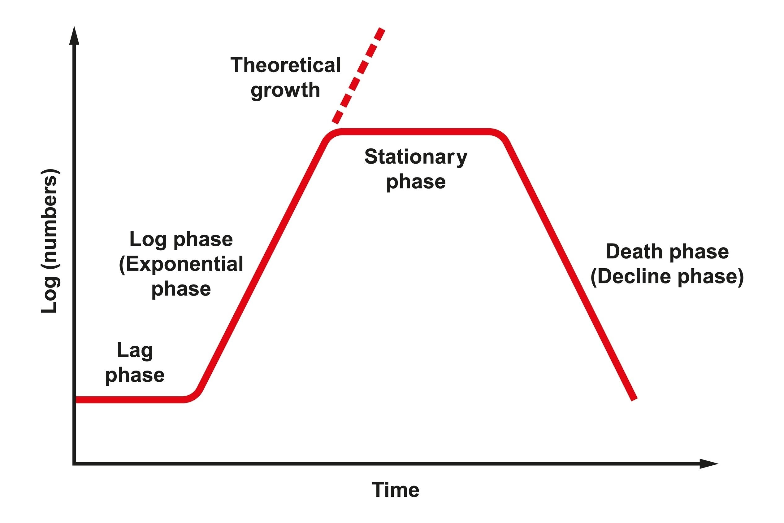
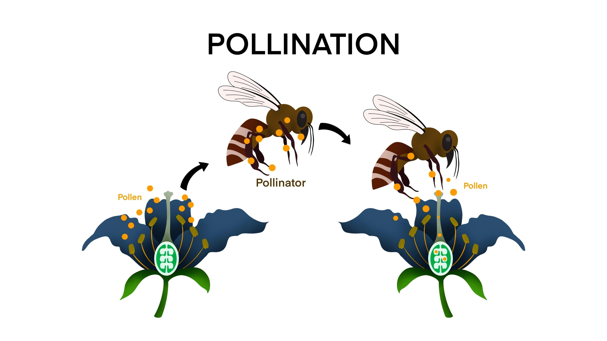
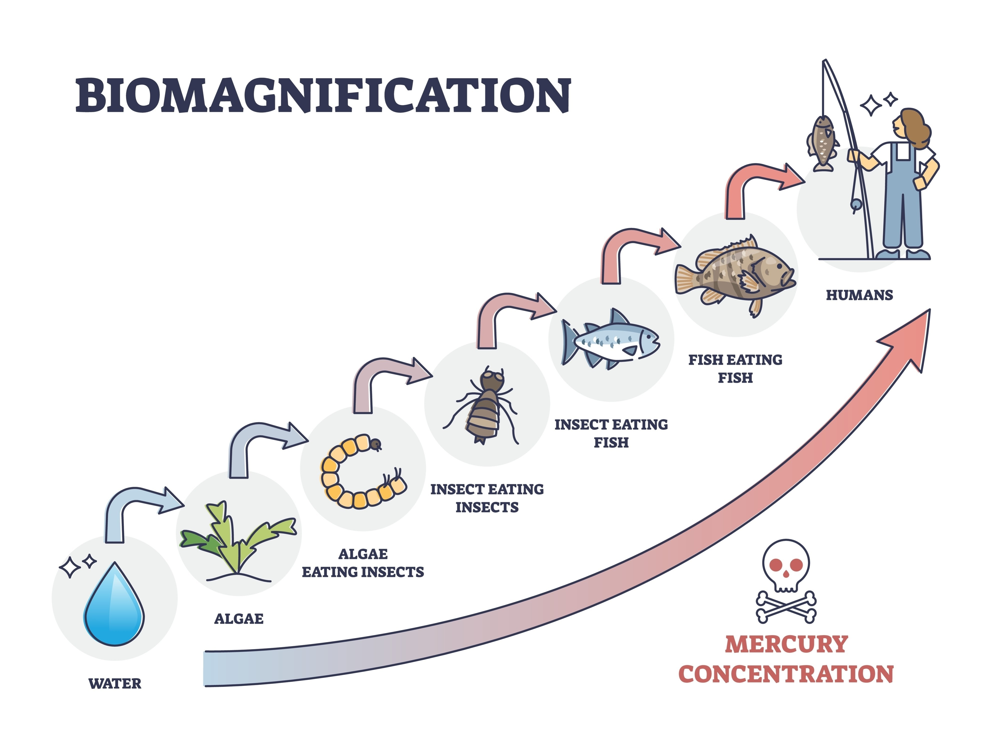

# Ecologia e Meio Ambiente: Biologia Populacional, Ciclos Biogeoquímicos, Ecossistema e Impactos Ambientais

## 1. DINÂMICA DE POPULAÇÕES (DEMOGRAFIA ECOLÓGICA)

A dinâmica populacional estuda as variações na abundância das espécies e os fatores que determinam essas flutuações.

### 1.1. Atributos da População
* **Densidade Populacional ($D$):** Número de indivíduos por unidade de área ou volume. $D = N / S$ (onde $N$ é o número de indivíduos e $S$ é a superfície/espaço).
* **Taxas Vitais:** * **Natalidade ($n$) e Imigração ($i$):** Fatores de acréscimo.
    * **Mortalidade ($m$) e Emigração ($e$):** Fatores de decréscimo.
* **Crescimento Real ($Nc$):** $Nc = (n + i) - (m + e)$.

### 1.2. Potencial Biótico ($r$) e Resistência Ambiental
O potencial biótico é a capacidade teórica de crescimento infinito. Na natureza, isso é impedido pela **Resistência do Meio**, que inclui:
* Disponibilidade de alimento e água.
* Espaço físico e abrigo.
* Pressão de predação e parasitismo.
* Acúmulo de metabólitos tóxicos.

### 1.3. O Modelo Matemático de Verhulst-Pearl
Diferente do crescimento exponencial (Curva em J), as populações reais seguem o **Crescimento Logístico (Curva em S)**.

**Equação Diferencial de Crescimento:**
$$\frac{dN}{dt} = rN \left( \frac{K - N}{K} \right)$$
* **Capacidade de Carga ($K$):** O "teto" sustentável do ecossistema. Quando $N = K$, o crescimento líquido é zero.
* **Carga Biótica Máxima:** O ponto onde a resistência ambiental iguala o potencial biótico.

### 1.4. Estratégias de Sobrevivência (Teoria da Seleção r/K)
* **Estrategistas r (r-selection):** Focam na quantidade.
    * Ambientes instáveis ou recém-formados (pioneiros).
    * Alta taxa de natalidade, maturidade precoce, prole pequena e sem cuidado parental.
    * Curva de sobrevivência Tipo III (alta mortalidade infantil).
* **Estrategistas K (K-selection):** Focam na qualidade.
    * Ambientes estáveis e competitivos (clímax).
    * Baixa natalidade, vida longa, maturidade tardia e alto investimento no cuidado parental.
    * Curva de sobrevivência Tipo I ou II (baixa mortalidade inicial).

---

## 2. RELAÇÕES ECOLÓGICAS (INTERAÇÕES BIÓTICAS)

As interações são classificadas pelo efeito (positivo, negativo ou neutro) e pelo nível (mesma espécie ou espécies diferentes).

### 2.1. Relações Harmônicas Intraespecíficas ($+/+$)

Estas interações ocorrem entre indivíduos da mesma espécie e são caracterizadas pela cooperação, resultando em benefícios mútuos que aumentam as chances de sobrevivência e reprodução do grupo em relação ao indivíduo isolado.

#### A. SOCIEDADES
As sociedades são organizações de indivíduos da mesma espécie que mantêm sua **independência física** e anatômica, mas apresentam um alto grau de cooperação e, frequentemente, uma organização social complexa.

* **Comunicação e Coesão:** A manutenção da sociedade depende de sistemas de comunicação (química via feromônios, tátil ou sonora).
* **Divisão de Trabalho (Castas):** É a característica principal. Os indivíduos são divididos em categorias funcionais.
    * **Polimorfismo Social:** Em muitas sociedades (especialmente insetos sociais), a função determina a forma do corpo.
    * *Exemplo - Abelhas (Apis mellifera):*
        * **Rainha:** Única fêmea fértil, responsável pela postura de ovos e controle da colmeia via feromônios.
        * **Zangões:** Machos férteis cuja única função é a fecundação da rainha durante o voo nupcial.
        * **Operárias:** Fêmeas estéreis que realizam todas as tarefas: coleta de néctar, limpeza, defesa e cuidado com as larvas.
    * *Exemplo - Formigas e Cupins:* Possuem castas ainda mais diversificadas, incluindo "soldados" com mandíbulas hipertrofiadas para defesa e "operários" para forrageamento.
* **Grau de Dependência:** Embora sejam fisicamente separados, a dependência é biológica; um indivíduo isolado de sua sociedade raramente sobrevive por longos períodos devido à especialização extrema.

#### B. COLÔNIAS
Diferente das sociedades, os indivíduos de uma colônia estão **unidos anatomicamente** (ligados fisicamente), formando uma unidade estrutural e funcional. Em muitos casos, é impossível distinguir onde termina um indivíduo e começa outro.

As colônias são classificadas de acordo com a morfologia e função de seus membros:

1.  **Colônias Isomorfas (Homotípicas):**
    * Todos os indivíduos que compõem a colônia são anatomicamente iguais e desempenham as mesmas funções vegetativas.
    * A união serve principalmente para proteção e aumento da eficiência na captura de recursos.
    * *Exemplos:* **Corais** (formados por milhares de pólipos que secretam um esqueleto calcário comum) e colônias de **Bactérias**.

2.  **Colônias Heteromorfas (Heterotípicas):**
    * Apresentam polimorfismo funcional: os indivíduos têm formas diferentes porque se especializaram em funções distintas dentro da mesma estrutura física.
    * Ocorre uma divisão de trabalho similar à das sociedades, mas com conexão física obrigatória.
    * *Exemplo Típico - Caravela-portuguesa (Physalia physalis):* O que parece um único animal é um conjunto de indivíduos (pólipos) especializados:
        * **Pneumatóforo:** O indivíduo que forma a "bolha" de gás responsável pela flutuação.
        * **Gastrozoides:** Indivíduos especializados na digestão do alimento capturado.
        * **Datilozoides:** Indivíduos repletos de células urticantes (cnidócitos) responsáveis pela defesa e captura de presas.
        * **Gonozoides:** Indivíduos responsáveis pela reprodução da colônia.

---

#### Resumo Técnico de Diferenciação

| Característica | Sociedade | Colônia |
| :--- | :--- | :--- |
| **Conexão Física** | Ausente (Indivíduos livres) | Presente (Indivíduos grudados) |
| **Divisão de Trabalho** | Sempre presente (Castas) | Opcional (Presente apenas nas Heteromorfas) |
| **Autonomia Individual** | Alta (em termos de locomoção) | Nula (corpos fundidos) |
| **Exemplos** | Abelhas, Formigas, Humanos | Corais, Caravela-portuguesa, Bactérias |

### 2.2. Relações Harmônicas Interespecíficas ($+/+$ ou $+/0$)

Ocorrem entre indivíduos de espécies diferentes. Pelo menos um se beneficia ($+$), e nenhum é prejudicado ($0$ ou $+$).

#### A. MUTUALISMO ($+/+$)
Nesta relação, ambos os parceiros se beneficiam. É subdividida conforme o grau de dependência:

1.  **Mutualismo Obrigatório (Simbiose Estrita):**
    * A sobrevivência de ambos depende da interação. Houve uma **coevolução** tão profunda que os organismos não conseguem manter seu metabolismo isoladamente.
    * **Líquens:** Associação entre um fungo (micobionte) e uma alga ou cianobactéria (fotobionte). O fungo absorve água e sais minerais e protege o fotobionte contra o ressecamento; a alga realiza fotossíntese e fornece compostos orgânicos.
    * **Micorrizas:** Fungos associados às raízes de plantas. O fungo aumenta a superfície de absorção de fósforo e nitrogênio da planta; a planta fornece açúcares.
    * **Cupins e Protozoários:** O cupim ingere madeira (celulose), mas não possui a enzima celulase. Os protozoários (*Trichonympha*) em seu trato digestivo digerem a celulose, liberando glicose para ambos.

2.  **Mutualismo Facultativo (Protocooperação):**
    * Apesar de benéfica, a relação não é essencial para a vida. Os organismos podem sobreviver de forma independente.
    * **Paguro e Anêmona:** O caranguejo-paguro (eremita) coloca anêmonas sobre sua concha. A anêmona ganha transporte e restos de comida; o caranguejo ganha camuflagem e defesa via células urticantes (cnidócitos) da anêmona.
    * **Dispersão e Polinização:** Animais que se alimentam de frutos e dispersam sementes, ou insetos que coletam néctar e polinizam flores.
    

#### B. COMENSALISMO ($+/0$)
Interação onde uma espécie (comensal) se beneficia de restos alimentares de outra, sem causar benefício ou prejuízo ao hospedeiro.

* **Rêmora e Tubarão:** A rêmora possui uma ventosa dorsal com a qual se fixa ao tubarão. Ela ganha transporte e alimenta-se dos restos de presas deixados pelo tubarão.
* **Entomofagia de Carnívoros:** Hienas e urubus que esperam que grandes predadores (leões) terminem sua refeição para consumir as carcaças.

#### C. INQUILINISMO E EPIFITISMO ($+/0$)
Relações de moradia ou suporte onde o "inquilino" busca proteção ou melhor posicionamento ambiental.

1.  **Inquilinismo Animal:**
    * Um animal vive no interior ou sobre outro para proteção.
    * **Peixe-agulha (*Fierasfer*) e Holotúria (Pepino-do-mar):** O peixe abriga-se no interior do sistema digestivo/respiratório da holotúria para fugir de predadores, saindo apenas para se alimentar.

2.  **Epifitismo (Inquilinismo Vegetal):**
    * Ocorre quando uma planta vive sobre outra para obter melhor acesso à luz solar (estratificação).
    * **Crucial:** As epífitas **não são parasitas**. Elas possuem raízes que apenas se fixam na casca, sem sugar seiva. Captam água da chuva e nutrientes da poeira/detritos acumulados.
    * **Exemplos:** Orquídeas, bromélias e diversas espécies de samambaias em florestas tropicais.
    

---

#### Tabela de Diferenciação Metabólica

| Relação | Dependência | Beneficiário | O que é trocado? |
| :--- | :--- | :--- | :--- |
| **Mutualismo Obrigatório** | Total | Ambos | Nutrientes essenciais e sobrevivência. |
| **Protocooperação** | Nula | Ambos | Proteção e facilitação alimentar. |
| **Comensalismo** | Nula | O Comensal | Excedente energético (restos). |
| **Epifitismo** | Nula | A Epífita | Suporte físico e acesso à radiação solar. |

### 2.3. Relações Desarmônicas Intraespecíficas ($+/-$ ou $-/-$)

Ocorrem entre indivíduos da **mesma espécie**. Nessas interações, há prejuízo para pelo menos um dos envolvidos, geralmente devido à escassez de recursos ou instintos de sobrevivência e reprodução.

#### A. COMPETIÇÃO INTRAESPECÍFICA ($-/-$)
É a disputa entre indivíduos da mesma espécie por recursos limitados do meio, como alimento, território, água, luz (no caso de plantas) e parceiros sexuais.

* **Fator Regulador:** É o principal mecanismo natural de controle do tamanho populacional. Quando a população se aproxima da **Capacidade de Carga ($K$)**, a competição intensifica-se, aumentando a taxa de mortalidade ou diminuindo a de natalidade.
* **Seleção Natural:** Os indivíduos mais aptos ou eficientes na obtenção do recurso sobrevivem e se reproduzem, passando seus genes adiante.
* **Exemplo:** Machos de leões ou de cervos que lutam violentamente pela posse de um harém de fêmeas e pelo controle do território.

#### B. CANIBALISMO ($+/-$)
Ocorre quando um indivíduo mata e se alimenta de outro da mesma espécie. Embora pareça cruel, no reino animal essa relação possui funções biológicas específicas:

1.  **Controle de Superpopulação:** Reduz o número de indivíduos quando o alimento é escasso.
2.  **Canibalismo Sexual:** A fêmea devora o macho após ou durante a cópula para obter nutrientes rápidos e garantir a produção de ovos saudáveis. 
    * *Exemplos:* **Louva-a-deus** e a aranha **Viúva-negra**.
3.  **Seleção de Prole:** Em algumas espécies, os filhotes mais fortes devoram os mais fracos para garantir que apenas os genes mais resistentes sobrevivam (comum em algumas espécies de tubarões ainda no útero).
4.  **Eliminação de Rivais:** Leões recém-chegados a um grupo podem praticar o infanticídio (matar os filhotes do antigo líder) para interromper a lactação das fêmeas e torná-las aptas ao novo acasalamento.

---

### 2.4. Relações Desarmônicas Interespecíficas ($+/-$ ou $-/-$)

Ocorrem entre espécies diferentes, onde pelo menos uma das espécies envolvidas é prejudicada pela interação.

#### A. PREDAÇÃO ($+/-$)

Um indivíduo (predador) captura, mata e devora outro (presa) para fins de subsistência. 

* **Importância Ecológica:** Atua como o principal regulador da densidade populacional, mantendo o equilíbrio da **Capacidade de Carga ($K$)** do ecossistema.
* **Coevolução e Defesa:** A predação impulsiona adaptações evolutivas em ambas as partes:
    * **Camuflagem:** O organismo se confunde com o meio (ex: bicho-pau).
    * **Mimetismo:** Uma espécie assemelha-se a outra para ganhar vantagem. Pode ser **Mülleriano** (duas espécies venenosas se parecem) ou **Batesiano** (uma espécie inofensiva imita uma perigosa, ex: cobra-falsa-coral).
    * **Aposematismo:** Coloração de advertência que indica toxicidade (ex: sapos coloridos da Amazônia).

#### B. PARASITISMO ($+/-$)

O parasita obtém nutrientes do hospedeiro sem a intenção imediata de matá-lo, pois depende da sua sobrevivência para completar seu ciclo vital.

1. **Classificação por Localização:**
    * **Ectoparasitas:** Externos (pulgas, carrapatos, piolhos).
    * **Endoparasitas:** Internos (tênias, lombrigas, protozoários como o *Trypanosoma cruzi*).
2. **Parasitismo Vegetal (Especializações):**
    * **Hemiparasitas:** Sugam apenas a seiva bruta (água e sais) do xilema do hospedeiro. Possuem clorofila e realizam fotossíntese. Ex: Erva-de-passarinho.
    * **Holoparasitas:** Sugam a seiva elaborada (açúcares) do floema. Perderam a clorofila e dependem totalmente do hospedeiro. Ex: Cipó-chumbo.
    * *Nota técnica:* Ambos utilizam raízes especializadas chamadas **haustórios** para penetrar no sistema vascular do hospedeiro.

#### C. COMPETIÇÃO INTERESPECÍFICA ($-/-$)

Disputa entre espécies diferentes por recursos limitados (alimento, território, luz). É considerada negativa para ambos devido ao alto gasto energético e risco de injúria física.

* **Princípio da Exclusão Competitiva (Princípio de Gause):** Se duas espécies ocupam exatamente o mesmo nicho ecológico no mesmo habitat, a competição será tão intensa que uma delas será inevitavelmente extinta ou forçada a migrar e sofrer **deslocamento de nicho**.

#### D. AMENSALISMO OU ANTIBIOSE ($0/-$)

Uma espécie inibe o crescimento ou a sobrevivência de outra através da liberação de substâncias metabólicas tóxicas, sem que haja benefício direto óbvio para o amensal.

* **Maré Vermelha:** Proliferação excessiva de algas pirrófitas (dinoflagelados) que liberam toxinas na água, causando mortandade em massa de peixes e moluscos.
* **Alelopatia:** Algumas plantas (como o eucalipto e o pinheiro) liberam substâncias no solo que impedem a germinação de outras sementes ao seu redor, reduzindo a competição futura.
* **Penicilina:** O fungo *Penicillium notatum* produz antibióticos que impedem o crescimento de colônias bacterianas.

#### E. ESCRAVAGISMO OU HELOTISMO ($+/-$)
Uma espécie se beneficia do trabalho de outra. 
* **Exemplo:** Algumas espécies de formigas saqueiam ninhos de outras espécies, roubando pupas. Ao nascerem, as formigas "escravas" realizam as tarefas do formigueiro invasor como se fosse o seu original.

---

#### Tabela de Impacto Desarmônico

| Relação | Alvo do Prejuízo | Mecanismo de Exploração |
| :--- | :--- | :--- |
| **Predação** | A Presa | Morte e ingestão imediata. |
| **Parasitismo** | O Hospedeiro | Retirada contínua de recursos metabólicos. |
| **Competição** | Ambos | Disputa energética por recursos escassos. |
| **Amensalismo** | O Amensal | Inibição química por toxinas ou antibióticos. |

#### Resumo Técnico de Impacto

| Relação | Tipo de Conflito | Função Biológica |
| :--- | :--- | :--- |
| **Competição** | Disputa por recursos | Seleção dos mais aptos e controle populacional. |
| **Canibalismo** | Predação direta | Suporte nutricional para reprodução ou controle de densidade. |

## 3. ENERGÉTICA DOS ECOSSISTEMAS (FLUXO DE ENERGIA)

A energia segue as Leis da Termodinâmica: ela não é reciclada. Entra como energia luminosa, é convertida em energia química e dissipa-se como calor (Entropia).

### 3.1. Produtividade Energética
A base de sustentação de qualquer ecossistema é a capacidade dos produtores (autótrofos) de converter energia radiante em ligações químicas.

* **Produtividade Primária Bruta (PPB):** Total de matéria orgânica (biomassa) produzida por unidade de área e tempo.
* **Produtividade Primária Líquida (PPL):** É a energia que realmente sobra para os consumidores.
    $$PPL = PPB - R$$
    Onde **R** representa a energia gasta na respiração celular para manutenção do metabolismo do próprio produtor.

### 3.2. A Regra dos 10% (Transferência de Energia)
O fluxo de energia é decrescente. De um nível trófico para o seguinte, aproveita-se apenas cerca de **10%** da energia disponível. Os outros **90%** são perdidos na forma de calor, fezes e urina.
* **Pirâmides de Energia:** Nunca são invertidas, pois a energia disponível no nível superior é sempre menor que no inferior.

---

## 4. CICLOS BIOGEOQUÍMICOS (DINÂMICA DA MATÉRIA)

Diferente da energia, a matéria é **cíclica**. Os átomos que compõem os seres vivos hoje são os mesmos que circularam há milhões de anos.

### 4.1. Ciclo do Nitrogênio ($N$) - O Ciclo dos Microrganismos

O nitrogênio é essencial para a formação de aminoácidos (proteínas) e bases nitrogenadas (DNA/RNA). A atmosfera possui 78% de $N_2$, mas ele é quimicamente inerte para a maioria dos seres.

1.  **Fixação Biológica:** Bactérias (*Rhizobium* em leguminosas e *Azotobacter* no solo) e cianobactérias quebram a tripla ligação do $N_2$ e o transformam em **Amônia ($NH_3$)** ou íon amônio ($NH_4^+$).
2.  **Nitrificação (Processo Aeróbio):**
    * **Nitrosação:** $2NH_3 + 3O_2 \rightarrow 2NO_2^- + 2H^+ + 2H_2O$. Realizada pelas bactérias *Nitrosomonas*. Transforma amônia em **Nitrito**.
    * **Nitratação:** $2NO_2^- + O_2 \rightarrow 2NO_3^-$. Realizada pelas bactérias *Nitrobacter*. Transforma nitrito em **Nitrato** (a forma preferencial de absorção pelas plantas).
3.  **Assimilação:** As plantas absorvem o nitrato e o incorporam em moléculas orgânicas.
4.  **Amonização (Decomposição):** Decompositores quebram proteínas de seres mortos e excretas (ureia), devolvendo amônia ao solo.
5.  **Desnitrificação (Processo Anaeróbio):** Bactérias como as *Pseudomonas denitrificans* transformam nitratos de volta em $N_2$ gasoso em solos pobres em oxigênio, fechando o ciclo.

### 4.2. Ciclo do Carbono ($C$)
O carbono é a base das moléculas orgânicas. Sua dinâmica está ligada ao clima global.
* **Fixação:** Fotossíntese e Quimiossíntese retiram $CO_2$ da atmosfera para formar glicose ($C_6H_{12}O_6$).
* **Liberação:** Respiração celular, decomposição e a **Combustão** (queima de biomassa e combustíveis fósseis) devolvem $CO_2$ ao ar.
* **Sequestro de Carbono:** Oceanos e florestas clímax atuam como grandes depósitos, mantendo o equilíbrio térmico.

### 4.3. Ciclo do Fósforo ($P$)
O fósforo é fundamental para o ATP (energia) e os ácidos nucleicos.
* **Diferencial:** É o único ciclo importante que **não possui fase gasosa**.
* **Dinâmica:** O reservatório está nas rochas fosfatadas. O **intemperismo** (chuva e vento) libera o fosfato para o solo e água, onde é absorvido pelos produtores. O retorno ocorre pela sedimentação no fundo dos oceanos, levando milhões de anos para aflorar novamente.

### 4.4. Ciclo da Água ($H_2O$)
A água atua como o solvente universal que integra todos os outros ciclos.
* **Pequeno Ciclo (Abiótico):** Envolve apenas processos físicos: Evaporação $\rightarrow$ Condensação $\rightarrow$ Precipitação.
* **Grande Ciclo (Biótico):** Envolve a passagem da água pelos seres vivos. Destaca-se a **Evapotranspiração** das plantas e a ingestão/excreção pelos animais.

---

### 4.5. Ciclo do Oxigênio ($O_2$)

O oxigênio é o elemento mais abundante em massa na crosta terrestre e nos oceanos, sendo vital para a respiração aeróbica e para a formação da camada de ozônio ($O_3$). Sua dinâmica é complexa pois ele circula em diversas formas químicas ($O_2$, $CO_2$, $H_2O$) e se integra aos ciclos do carbono e da água.

#### Dinâmica Biológica (Fluxo Principal)

* **Liberação (Produção):** Ocorre através da **Fotossíntese** (principalmente pelo fitoplâncton marinho e florestas). A quebra da molécula de água pela luz (**Fotólise da Água**) libera o oxigênio gasoso ($O_2$) para a atmosfera.
    $$12H_2O + 6CO_2 + Luz \rightarrow C_6H_{12}O_6 + 6H_2O + 6O_2$$
* **Consumo:** 1.  **Respiração Celular:** Utilizado pelos seres aeróbicos para oxidar a glicose e obter energia (ATP), resultando em $CO_2$ e $H_2O$.
    2.  **Combustão:** Reações de queima de matéria orgânica e combustíveis fósseis consomem $O_2$.
    3.  **Decomposição:** Microrganismos aeróbicos utilizam oxigênio para degradar matéria orgânica morta.
    4.  **Oxidação:** Reações químicas com minerais (como a formação de ferrugem).

#### A Camada de Ozônio ($O_3$)
Na alta atmosfera (estratosfera), o oxigênio sofre ação da radiação ultravioleta (UV), passando por um ciclo de quebra e recombinação que forma o ozônio:
1.  O $O_2$ é quebrado pela radiação UV em dois átomos de oxigênio livres.
2.  Um átomo livre se une a uma molécula de $O_2$, formando $O_3$ (Ozônio).
3.  O ozônio absorve a radiação UV-B, protegendo o DNA dos seres vivos de mutações letais.

#### Interdependência entre Ciclos
O ciclo do oxigênio é o "espelho" do ciclo do carbono: enquanto a fotossíntese consome $CO_2$ e libera $O_2$, a respiração consome $O_2$ e libera $CO_2$. Por isso, o equilíbrio das taxas de fotossíntese global é crítico para a manutenção da atmosfera respirável.

## 5. SUCESSÃO ECOLÓGICA

É o processo gradual e ordenado de alteração da composição de uma comunidade ao longo do tempo até atingir a estabilidade.

### 5.1. Etapas Sucessionais
1.  **Écese (Comunidade Pioneira):** Primeiros colonizadores (Líquens, Musgos). São estrategistas $r$, resistentes a condições extremas e responsáveis pela formação inicial do solo.
2.  **Sere (Estágios Seriais):** Fases intermediárias (ervas, arbustos). A biodiversidade e a biomassa aumentam.
3.  **Clímax:** Estágio final de equilíbrio. A teia alimentar é complexa, a biodiversidade é máxima e a **PPL tende a zero** (quase tudo o que é produzido é consumido pela própria manutenção da floresta).

### 5.2. Tipos de Sucessão
* **Primária:** Ocorre em locais "virgens" (lava vulcânica, rochas nuas, dunas). Processo extremamente lento.
* **Secundária:** Ocorre em locais que já foram habitados, mas sofreram perturbação (desmatamento, queimada, campos abandonados). É muito mais rápida pois o solo e o banco de sementes já existem.

## 6. ECOSSISTEMAS TERRESTRES E AQUÁTICOS

A distribuição dos seres vivos é governada por fatores abióticos: luz, temperatura, água e nutrientes.

### 6.1. Biomas Terrestres (Fitogeografia)
* **Tundra:** Clima polar. Solo com **permafrost** (camada permanentemente congelada). Vegetação rasteira de líquens e musgos.
* **Taiga (Floresta de Coníferas):** Clima frio. Árvores aciculifoliadas (folhas em agulha) e em formato de cone para resistir ao peso da neve.
* **Floresta Temperada:** Quatro estações bem definidas. Árvores **caducifólias** ou decíduas (perdem as folhas no inverno para economizar energia).
* **Floresta Tropical:** Alta biodiversidade e pluviosidade. Estratificação vertical (andares de vegetação). Solo pobre, mas com reciclagem rápida de matéria orgânica.
* **Savana (Cerrado):** Estação seca e chuvosa. Árvores tortuosas com cascas grossas (proteção contra fogo) e raízes profundas.
* **Deserto:** Escassez hídrica. Plantas **xerófitas** (espinhos e parênquima aquífero). Animais com urina concentrada.

### 6.2. Ecossistemas Aquáticos
A classificação baseia-se na salinidade e na profundidade (penetração da luz).
* **Lóticos:** Águas em movimento (rios e riachos).
* **Lênticos:** Águas paradas (lagos e represas).
* **Talassociclo (Marinho):**
    * **Zona Fótica:** Até onde a luz penetra (~200m). Rica em fitoplâncton.
    * **Zona Afótica:** Escuridão total. Depende da quimiossíntese ou da "neve marinha" (restos orgânicos).

#### Classificação dos Seres Aquáticos:
1.  **Plâncton:** Flutuam passivamente. (Fitoplâncton = produtores; Zooplâncton = consumidores).
2.  **Nécton:** Nadadores ativos (peixes, baleias).
3.  **Bentos:** Vivem associados ao fundo (corais, estrelas-do-mar).

---

## 7. POLUIÇÃO AMBIENTAL E IMPACTOS TÉCNICOS

A poluição ocorre quando a introdução de substâncias ou energia altera o equilíbrio biológico.

### 7.1. Eutrofização (A Morte dos Corpos d'Água)
É o enriquecimento por nutrientes (N e P), comum por descarte de esgoto ou fertilizantes.
1.  **Bloom Algal:** Explosão de algas na superfície.
2.  **Sombreamento:** Morte das plantas submersas por falta de luz.
3.  **Decomposição Aeróbica:** Aumento de bactérias que consomem o $O_2$ dissolvido.
4.  **Anoxia:** O oxigênio acaba, causando a morte de peixes por asfixia.
5.  **Decomposição Anaeróbica:** Liberação de gases fétidos ($H_2S$) e metano.

### 7.2. Poluição Atmosférica e Química
* **Chuva Ácida:** Emissão de $SO_2$ e $NO_x$ (queima de carvão/petróleo). Reagem com a umidade formando $H_2SO_4$ e $HNO_3$. Acidifica solos e corrói monumentos.
* **Inversão Térmica:** Fenômeno físico onde o ar frio (denso) fica preso abaixo de uma camada de ar quente, impedindo a dispersão da poluição nas cidades.
* **Magnificação Trófica (Bioacumulação):** Acúmulo de substâncias não biodegradáveis (Mercúrio, DDT). A concentração **aumenta** ao longo da cadeia alimentar; os predadores de topo são os mais afetados.

### 7.3. Aquecimento Global e Efeito Estufa
O efeito estufa é um processo natural essencial. O problema é sua **intensificação** pelo aumento de $CO_2$, $CH_4$ (metano) e $N_2O$.
* **Acidificação dos Oceanos:** O excesso de $CO_2$ absorvido pelo mar forma ácido carbônico, reduzindo a disponibilidade de carbonatos para corais e moluscos.

---

## 8. INTERVENÇÕES HUMANAS E ALTERAÇÕES DE ECOSSISTEMAS

* **Fragmentação de Habitats:** Criação de "ilhas" de floresta que isolam populações, reduzindo a variabilidade genética.
* **Espécies Exóticas Invasoras:** Espécies introduzidas sem predadores naturais. Elas ocupam nichos nativos e causam extinções em massa.
* **Impermeabilização do Solo:** Pavimentação urbana que impede a recarga de lençóis freáticos e causa enchentes instantâneas.

## 9. MATRIZ ENERGÉTICA E ALTERNATIVAS SUSTENTÁVEIS

A transição energética visa substituir fontes de alta emissão de gases de efeito estufa (GEE) por fontes de baixa emissão ou neutras em carbono.

### 9.1. Fontes Renováveis (Fluxo Constante)
* **Energia Solar:** Conversão direta de radiação em eletricidade (Fotovoltaica) ou calor (Térmica).
    * *Desafio:* Intermitência (dependência de baterias para uso noturno).
* **Energia Eólica:** Cinética dos ventos convertida em mecânica por aerogeradores.
    * *Desafio:* Poluição sonora e risco para a fauna alada (aves e morcegos).
* **Biomassa:** Queima de matéria orgânica ou biogás. É considerada neutra em carbono pois o $CO_2$ liberado foi absorvido pela planta durante o crescimento.
* **Energia Maremotriz e Ondomotriz:** Aproveitamento das marés e ondas.
* **Hidrogênio Verde:** Produzido via eletrólise da água usando fontes 100% renováveis. O subproduto da queima é apenas vapor d'água ($H_2O$).

### 9.2. Energia Nuclear (Baixa Emissão, Não Renovável)
Utiliza a fissão de núcleos de urânio.
* **Vantagem:** Altíssima densidade energética e quase zero emissão de $CO_2$.
* **Impacto:** Risco de acidentes catastróficos e o passivo ambiental do lixo radioativo, que requer armazenamento geológico por milênios.

---

## 10. MÉTRICAS DE SUSTENTABILIDADE E PEGADA ECOLÓGICA

A sustentabilidade é medida pelo equilíbrio entre a demanda humana e a oferta do planeta.

### 10.1. Pegada Ecológica
É um indicador que traduz o consumo de recursos e a absorção de resíduos de uma população em **Hectares Globais (gha)**.
* **Componentes:** Pegada de carbono, áreas de cultivo, pastagens, áreas florestais, zonas de pesca e áreas construídas.
* **Biocapacidade:** Representa a oferta de serviços ecossistêmicos que uma área pode regenerar.
* **Déficit Ecológico:** Ocorre quando a Pegada Ecológica > Biocapacidade.

### 10.2. Desenvolvimento Sustentável
Definido como o desenvolvimento que satisfaz as necessidades do presente sem comprometer a capacidade das gerações futuras. Apoia-se no **Tripé da Sustentabilidade (Triple Bottom Line)**:
1.  **Econômico:** Viabilidade e lucro.
2.  **Social:** Equidade e bem-estar humano.
3.  **Ambiental:** Conservação de recursos e biodiversidade.

---

## 11. CONSERVAÇÃO BIOLÓGICA E ESTRATÉGIAS DE PROTEÇÃO

A biologia da conservação aplica princípios científicos para evitar a extinção de espécies e o colapso de ecossistemas.

### 11.1. Unidades de Conservação (UCs)
No Brasil, são regidas pelo SNUC (Sistema Nacional de Unidades de Conservação):
* **Proteção Integral:** Não permite consumo de recursos. Foco em pesquisa e educação (ex: Parques Nacionais).
* **Uso Sustentável:** Concilia conservação com uso controlado de recursos (ex: Reservas Extrativistas).

### 11.2. Técnicas de Manejo e Recuperação
* **Corredores Ecológicos:** Conexões de vegetação entre fragmentos isolados. Reduzem o **efeito de borda** e garantem o **fluxo gênico**, evitando a depressão por endogamia (cruzamento entre parentes próximos).
* **Restauração Ecológica:** Intervenção ativa para recuperar a estrutura de um ecossistema degradado (ex: replantio de matas ciliares).
* **Hotspots de Biodiversidade:** Áreas com alto índice de espécies endêmicas (que só existem ali) e que já perderam mais de 70% de sua cobertura original.

---

## 12. GLOSSÁRIO TÉCNICO DE CONSOLIDAÇÃO

Este glossário define termos fundamentais e fenômenos complexos abordados ao longo deste tratado, servindo como guia de referência rápida.

* **Albedo:** Capacidade de reflexão de uma superfície (como o gelo). A redução do albedo devido ao derretimento das calotas polares acelera o aquecimento global (feedback positivo).
* **Anoxia:** Ausência total de oxigênio em um ambiente (comum no fundo de lagos eutrofizados), levando à morte de organismos aeróbicos.
* **Antropoceno:** Termo geológico (proposto) para descrever a época atual, na qual as atividades humanas tornaram-se a principal força motriz das mudanças biofísicas globais.
* **Assoreamento:** Acúmulo de sedimentos (areia, terra) no leito dos rios, geralmente causado pela erosão das margens após a retirada da mata ciliar.
* **Biocapacidade:** Capacidade de um ecossistema de regenerar recursos e absorver resíduos gerados pelo homem. É a contraparte da Pegada Ecológica.
* **Biodisponibilidade:** Medida da facilidade com que um elemento (como o nitrogênio ou um poluente) pode ser absorvido pelos seres vivos no ecossistema.
* **Biomagnificação (ou Magnificação Trófica):** Processo de acúmulo progressivo de substâncias não biodegradáveis e lipossolúveis (DDT, Mercúrio) ao longo dos níveis tróficos.
* **Dificuldade Biológica (Resistência do Meio):** Conjunto de fatores (predação, falta de alimento, clima) que limitam o potencial biótico de uma população.
* **Efeito de Borda:** Alterações nas condições ambientais (luz, vento, umidade) que ocorrem no limite entre uma área preservada e uma área desmatada, prejudicando espécies do interior da mata.
* **Endemismo:** Fenômeno em que uma espécie ocorre exclusivamente em uma determinada região geográfica (ex: Mico-leão-dourado na Mata Atlântica).
* **Espécie-Chave (Keystone Species):** Espécie que exerce uma influência desproporcionalmente grande na estrutura de sua comunidade, e cuja remoção pode causar o colapso do ecossistema.
* **Estuário:** Ecossistema de transição (ecótono) entre um rio e o mar. Apresenta salinidade variável e é considerado um "berçário" devido à alta produtividade e abrigo.
* **Estratégia r/K:** Modelos de história de vida; "r" foca em quantidade e velocidade de reprodução; "K" foca em qualidade e estabilidade competitiva.
* **Eurialino / Estenoalino:** Organismos eurialinos suportam grandes variações de salinidade; estenoalinos exigem salinidade constante.
* **Lixiviação:** Processo de "lavagem" de nutrientes solúveis das camadas superficiais do solo pela água da chuva, transportando-os para o lençol freático ou rios.
* **Nicho Ecológico:** O "papel" ou "profissão" de uma espécie no ecossistema, incluindo seus hábitos alimentares, horários de atividade e interações.
* **Piracema:** Fenômeno migratório de peixes (como o salmão e o pintado) que nadam contra a correnteza para desovar nas nascentes; essencial para a manutenção genética das populações.
* **Potencial Biótico ($r$):** Capacidade teórica máxima de crescimento de uma população em condições ideais de recursos e ausência de predadores.
* **Resiliência Ecológica:** Capacidade de um sistema absorver distúrbios (queimadas, secas) e reorganizar-se, mantendo basicamente as mesmas funções e estruturas.
* **Xerófitas:** Plantas adaptadas a ambientes áridos, possuindo estruturas como cutículas grossas, estômatos protegidos ou parênquima aquífero para armazenamento de água.