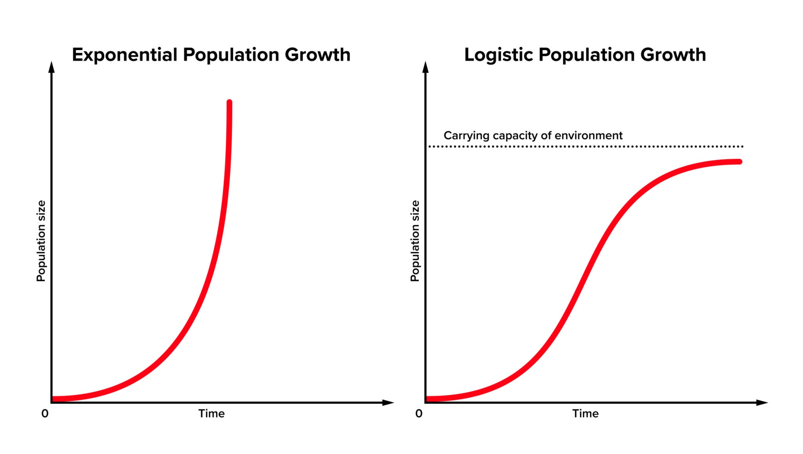

# 🌿 ECOLOGIA: FUNDAMENTOS E DINÂMICA TÉCNICA

Este documento consolida os conceitos biológicos, mecanismos fisiológicos, equações matemáticas e classificações técnicas necessárias para exames de alto desempenho.

---

## 1. DINÂMICA DE POPULAÇÕES E REGULAÇÃO

### 1.1. O Motor da Vida: Potencial Biótico ($r$)

O potencial biótico não é apenas um número, é a "promessa" reprodutiva de uma espécie. Se você colocasse um único casal de moscas-das-frutas em um mundo feito de banana e sem sapos, em poucos meses elas cobririam a crosta terrestre.

* **O que define um $r$ alto?**
    * **Idade da primeira reprodução:** Quanto mais cedo começam a procriar, maior o potencial.
    * **Frequência reprodutiva:** Quantas vezes por ano se reproduzem.
    * **Tamanho da prole:** Uma tartaruga marinha põe 100 ovos; um humano tem um filho por vez. O potencial da tartaruga é maior.
* **A Curva em J:** É o gráfico do "sonho" da espécie. No início, o crescimento é lento (fase lag), mas logo explode verticalmente (fase log).

---

### 1.2. O Freio da Natureza: Resistência do Meio

A resistência do meio é o que impede o "apocalipse das moscas" mencionado acima. Ela é a soma de tudo o que causa mortes ou impede nascimentos.

#### Detalhando os Fatores:

* **Espaço Vital:** À medida que a população cresce, falta lugar para nidificação ou raízes.
* **Acúmulo de Excretas:** Em populações densas (como leveduras em uma dorna de fermentação), o próprio resíduo (álcool/amônia) torna-se tóxico e mata a população.
* **Vigilância de Predadores:** Quanto mais presas existem, mais fácil é para o predador caçar. O predador atua como um regulador que aumenta sua eficiência conforme a densidade da presa aumenta.

---

### 1.3. A Curva Sigmoide (S) e a Capacidade de Carga ($K$)

Esta é a curva da realidade. Ela tem 4 fases distintas que você deve identificar:
1.  **Fase Lag (Positiva):** Início lento, adaptação ao meio.
2.  **Fase Log (Exponencial):** O potencial biótico domina; os recursos ainda são abundantes.
3.  **Fase de Desaceleração:** A resistência do meio começa a "morder". A taxa de crescimento diminui.
4.  **Estabilidade (Equilíbrio):** A população flutua em torno de $K$.

> **Exemplo Prático:** Imagine um aquário. Se você coloca 2 peixes, eles têm comida e espaço de sobra ($r$ domina). Eles se reproduzem e chegam a 50 peixes. Agora, a água suja mais rápido e a comida acaba logo (resistência aumenta). O aquário só suporta 80 peixes. Esse **80** é o seu **K**. Se nascer o peixe nº 81, um provavelmente morrerá por falta de oxigênio ou fome.

---

### 1.4. Aprofundamento: Estratégias $r$ e $K$

Esta é uma das partes mais cobradas em vestibulares porque conecta evolução com ecologia.

| Característica | Estrategistas $r$ (Oportunistas) | Estrategistas $K$ (Equilibrados) |
| :--- | :--- | :--- |
| **Ambiente** | Instável, imprevisível (ex: poça d'água após chuva). | Estável, previsível (ex: floresta amazônica). |
| **Tamanho do corpo** | Geralmente pequenos. | Geralmente grandes. |
| **Vida útil** | Curta. | Longa. |
| **Exemplo** | Gafanhotos, bactérias, ervas daninhas. | Elefantes, carvalhos, seres humanos. |
| **Gráfico** | Sofrem grandes oscilações (explosões e colapsos). | Mantêm-se próximos à linha $K$. |

---

### 1.5. Fatores Dependentes vs. Independentes de Densidade

Para não confundir mais:

* **Dependentes (Bióticos):** Imagine uma sala com 100 pessoas e uma pessoa gripada. O vírus se espalha rápido. Se houvesse 2 pessoas na sala, o vírus morreria ali. **Doença, fome e competição** dependem de quão "apertados" os indivíduos estão.
* **Independentes (Abióticos):** Se cair um raio na floresta e causar um incêndio, ele vai queimar as árvores independentemente de haver 10 ou 10.000 árvores por hectare. **Geada, fogo, furacão e pH do solo** não "querem saber" o tamanho da população; eles simplesmente acontecem.

---

### 1.6. O Modelo Matemático de Crescimento (Fórmula Logística)

$$\frac{dN}{dt} = rN \left(1 - \frac{N}{K}\right)$$
* **$dN/dt$**: Taxa de variação da população no tempo.
* **$r$ (Potencial Biótico)**: Taxa de crescimento intrínseco em condições ideais.
* **$N$**: Número de indivíduos atual.
* **$K$ (Capacidade de Carga)**: Limite máximo de indivíduos que o ambiente suporta.
* **Resistência do Meio**: Representada pelo fator $(1 - N/K)$.

* Se o número de indivíduos ($N$) é muito pequeno, o termo $(1 - N/K)$ é quase **1**. Ou seja, a população cresce quase no seu potencial total ($rN$).
* Se a população chega perto do limite ($N = K$), o termo vira $(1 - 1) = 0$. Multiplicar por zero faz o crescimento ($dN/dt$) parar. A população estaciona.

**Dica para o Simulado:** Fique atento a questões que mostram gráficos onde a população ultrapassa muito a linha $K$. Geralmente, isso causa um colapso ambiental (destruição do recurso), fazendo com que a nova capacidade de carga ($K$) seja menor do que a original ou levando à extinção local.

---

## 2. SUCESSÃO ECOLÓGICA E BIOENERGÉTICA

Processo ordenado de mudança na estrutura e composição da comunidade ao longo do tempo.

### 2.1. Estágios e Razão P/R
1.  **Ecese (Comunidade Pioneira):** Organismos "rústicos" (liquens, musgos) que colonizam áreas inóspitas. Baixa biodiversidade, mas alta produtividade primária líquida (PPL). **$P > R$** (Produtividade supera o consumo); baixa biodiversidade, mas alto acúmulo de biomassa inicial.
2.  **Sere (Estágios Intermediários):** Aumento gradual da complexidade, teias alimentares, biomassa e biodiversidade (ervas, arbustos).
3.  **Clímax:** Estágio de equilíbrio dinâmico e homeostase. A biodiversidade e a biomassa são máximas, mas a PPL é próxima de zero (toda energia produzida é consumida pela própria comunidade). **$P = R$**. Biodiversidade e biomassa máximas, mas Produtividade Primária Líquida (PPL) próxima de zero.

### 2.2. Tipos de Sucessão

* **Primária:** Ocorre em substratos nunca antes habitados (rochas nuas, lavas vulcânicas resfriadas).
* **Secundária:** Ocorre em áreas que já abrigaram uma comunidade (áreas desmatadas, abandonadas ou queimadas). É muito mais rápida devido ao solo já formado e ao banco de sementes/esporos.

---

## 3. ECOSSISTEMAS TERRESTRES E AQUÁTICOS

Os ecossistemas são classificados de acordo com suas características físicas e biológicas predominantes.

### 3.1. Biomas Terrestres Principais

| Bioma | Clima | Solo | Vegetação Característica |
| :--- | :--- | :--- | :--- |
| **Tundra** | Ártico (Frio Extremo) | Permafrost (gelado) | Musgos e liquens; ausência de árvores. |
| **Taiga (Coníferas)** | Temperado Frio | Ácido e pobre | Pinheiros (folhas aciculifoliadas - em agulha). |
| **Floresta Tropical** | Quente e Úmido | Pobre (nutrientes na biomassa) | Latifoliada, perenifólia, perene, alta biodiversidade. |
| **Savana (Cerrado)** | Tropical Sazonal | Ácido/Alumínico | Arbustos tortuosos, casca grossa, raízes profundas. |
| **Deserto** | Árido (seco) | Arenoso/Rochoso | Xerófitas (cactos com parênquima aquífero). |

### 3.2. Ecossistemas Aquáticos (Talassociclo e Limnociclo)

* **Domínio Marinho (Talassociclo):** Dividido por profundidade e luz. Caracterizado por **Zonas de Luz:**
    * **Zona Fótica (Eufótica):** Até 200m; ocorre fotossíntese ($P > R$).
    * **Zona de Compensação:** Profundidade onde $P = R$.
    * **Zona Afótica:** Escuridão total; apenas respiração e decomposição ($R > P$).

* **Domínio Dulcícola (Limnociclo):**. Caracterizado por **Águas Doces:**
    * **Lóticos:** Águas correntes (rios).
    * **Lênticos:** Águas paradas (lagos, pântanos).

---

## 4. RELAÇÕES ECOLÓGICAS (INTERAÇÕES)

As interações determinam a sobrevivência e a evolução das espécies.

| Relação | Tipo | Sinais | Descrição/Exemplo |
| :--- | :--- | :--- | :--- |
| **Sociedade** | Intraespecífica (+) | (+/+) | Indivíduos da mesma espécie, independentes fisicamente, com divisão de tarefas (abelhas). |
| **Colônia** | Intraespecífica (+) | (+/+) | Indivíduos unidos anatomicamente (corais). |
| **Mutualismo** | Interespecífica (+) | (+/+) | Obrigatória para sobrevivência (liquens, micorrizas). |
| **Protocooperação** | Interespecífica (+) | (+/+) | Benéfica, mas facultativa (caranguejo-eremita e anêmona). |
| **Comensalismo** | Interespecífica (+) | (+/0) | Um se beneficia de restos alimentares sem afetar o outro (rêmora e tubarão). |
| **Inquilinismo** | Interespecífica (+) | (+/0) | Um usa o outro como suporte/moradia (epífitas). |
| **Predação** | Interespecífica (-) | (+/-) | Um indivíduo mata e consome outro de espécie diferente (leão e zebra). |
| **Parasitismo** | Interespecífica (-) | (+/-) | Um vive às custas do hospedeiro, geralmente sem matá-lo de imediato (carrapato, vírus). |
| **Competição** | Inter/Intra (-) | (-/-) | Disputa por recursos limitados (nicho ecológico). Ambos perdem energia no processo. |
| **Amensalismo** | Interespecífica (-) | (-/0) | Um inibe o crescimento do outro (antibióticos, Maré Vermelha). |

---

## 5. PIRÂMIDES E CICLOS BIOGEOQUÍMICOS

### 5.1. Pirâmides Ecológicas
1.  **Pirâmide de Energia:** Unidirecional. **Nunca se inverte**. A energia flui unidirecionalmente e diminui em cerca de 90% a cada nível (Lei dos 10%).
2.  **Pirâmide de Biomassa:** Quantidade de matéria orgânica seca. Pode ser invertida em oceanos (onde o fitoplâncton se reproduz tão rápido que sustenta uma biomassa maior de zooplâncton).
3.  **Pirâmide de Números:** Quantidade de indivíduosInverte-se quando, por exemplo, uma única árvore (produtor) sustenta milhares de pulgões (consumidor). Pode ser invertida (ex: uma árvore sustentando mil insetos).

### 5.2. Ciclos Biogeoquímicos Fundamentais

* **Ciclo do Carbono:** A **fotossíntese** retira $CO_2$ da atmosfera (fixação), enquanto a **respiração**, **decomposição** e **combustão** o devolvem. O desequilíbrio (queima de fósseis) causa o aquecimento global.
* **Ciclo do Nitrogênio ($N_2$):**
    1.  *Fixação:* Bactérias (*Rhizobium*) transformam $N_2$ em amônia ($NH_3$).
    2.  *Nitrificação:* Amônia vira nitrito ($NO_2^-$) e depois nitrato ($NO_3^-$), que as plantas absorvem.
    3.  *Desnitrificação:* Bactérias devolvem $N_2$ para a atmosfera.
* **Ciclo da Água:** Movimento entre os estados físicos, impulsionado pela energia solar. A evapotranspiração vegetal é vital para a formação de chuvas continentais.

#### 5.2.1. Ciclo do Nitrogênio ($N_2$) - Processos Bioquímicos

1.  **Fixação:** $N_2 \rightarrow NH_3$ (Amônia) por bactérias *Rhizobium* (em leguminosas) ou cianobactérias.
2.  **Nitrosação:** $NH_3 \rightarrow NO_2^-$ (Nitrito) por bactérias *Nitrosomonas*.
3.  **Nitratação:** $NO_2^- \rightarrow NO_3^-$ (Nitrato) por bactérias *Nitrobacter*.
4.  **Desnitrificação:** $NO_3^- \rightarrow N_2$ por bactérias *Pseudomonas denitrificans*.

#### 5.2.2. Ciclos do Carbono e Água

* **Carbono:** Fixação via fotossíntese; liberação via respiração, decomposição e combustão.
* **Água:** Ciclo impulsionado pelo sol (evapotranspiração, condensação, precipitação).

---

## 6. IMPACTOS AMBIENTAIS E POLUIÇÃO

### 6.1. Eutrofização Artificial (Passo a Passo)

É o excesso de nutrientes (esgoto/fertilizantes) em corpos d'água.
* **Sequência:** 1. Excesso de Nutrientes (N e P) $\rightarrow$ 2. Proliferação de Algas (Bloom) $\rightarrow$ 3. Bloqueio da Luz $\rightarrow$ 4. Morte de Plantas do fundo $\rightarrow$ 5. Proliferação de bactérias decompositoras aeróbicas $\rightarrow$ **6. Esgotamento do Oxigênio ($O_2$)** $\rightarrow$ 7. Morte da fauna (peixes) $\rightarrow$ 8. Decomposição Anaeróbica (mau cheiro).

### 6.2. Intervenção Humana e Conservação

* **Pegada Ecológica:** Traduz o consumo humano em área de terra necessária. Se a pegada mundial > 1 planeta, estamos em déficit ecológico.
* **Espécies Exóticas:** Ao serem introduzidas, não possuem predadores naturais e competem agressivamente com as nativas, podendo causar extinções em massa.
* **Alternativas Energéticas:**
    * *Solar/Eólica:* Renováveis e limpas, mas dependem de baterias e condições climáticas.
    * *Nuclear:* Não emite gases de efeito estufa, mas gera **lixo radioativo** de longa duração e riscos de acidentes.

---

### 6.3. Tabela Comparativa de Impactos Atmosféricos e Terrestres

| Impacto | Causa Principal | Consequência/Mecanismo |
| :--- | :--- | :--- |
| **Aquecimento Global** | Queima de combustíveis fósseis | Aumento do efeito estufa, nível do mar e climas extremos. |
| **Inversão Térmica** | Poluição urbana + Inverno | Retenção de poluentes próximos ao solo (doenças respiratórias), Ar frio preso abaixo do quente; concentração de poluentes. |
| **Chuva Ácida** | Óxidos de enxofre e nitrogênio ($SO_2$ e $NO_x$) | Acidificação de solo/água e corrosão de monumentos. |
| **Ilhas de Calor** | Urbanização/Asfalto | Retenção de calor em centros urbanos. |

> **Nota Crítica: Bioacumulação (Magnificação Trófica):** Substâncias não biodegradáveis (Mercúrio, DDT) aumentam sua concentração em cada nível trófico. O **consumidor de topo** é sempre o mais contaminado.

---

## 7. CONSERVAÇÃO E ENERGIA

### 7.1. Alternativas Energéticas

* **Renováveis:** Solar, Eólica, Hídrica e Biomassa.
* **Não Renováveis (Nuclear):** Vantagem: baixa emissão de gases estufa. Desvantagem: **lixo radioativo** e riscos de acidentes.

### 7.2. Unidades de Conservação (SNUC)

* **Proteção Integral:** Preservação sem interferência humana direta (ex: Estações Ecológicas, Parques Nacionais). Uso indireto apenas.
* **Uso Sustentável:** Exploração planejada de recursos (ex: APA, Reservas Extrativistas/RESEX).

### 7.3. Pegada Ecológica

Medida em hectares globais (gha), representa a área necessária para sustentar o estilo de vida de uma população. Se a demanda supera a **Biocapacidade** da Terra, há um déficit ecológico.
