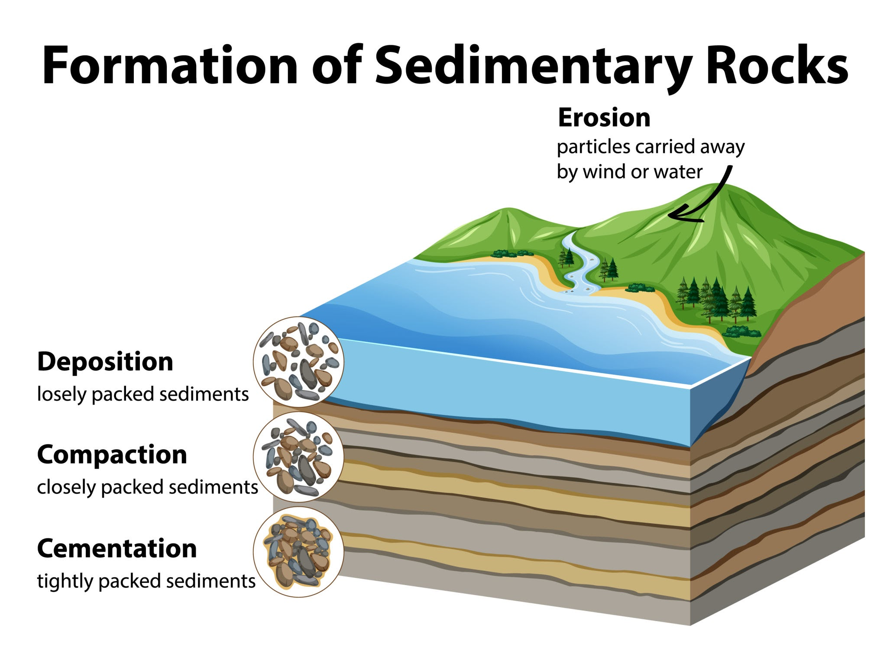
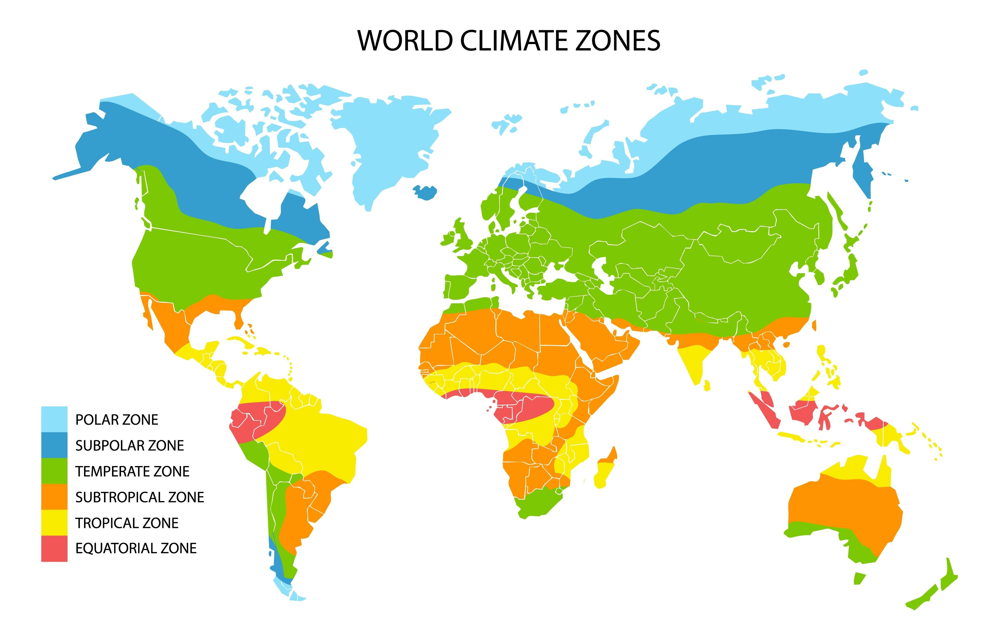

# Geografia Física e Questão Ambiental

## Geologia, Relevo e Solo (Litosfera)

> *Este bloco une a base rochosa à superfície onde pisamos.*

### Escudos Cristalinos e Crátons

Os **Escudos Cristalinos** (também chamados de Maciços Antigos ou Crátons) representam a "espinha dorsal" da litosfera continental. São as formações geológicas mais antigas da Terra, datando das eras **Pré-Cambriana** (Arqueozoica e Proterozoica).

#### Formação e Constituição
Estas estruturas formaram-se durante o resfriamento inicial da crosta terrestre ou através de processos de metamorfismo profundo em antigos dobramentos que, ao longo de bilhões de anos, foram desgastados pela erosão.

* **Composição Litológica:** Predominam rochas **Magmáticas Intrusivas** (como o Granito) e rochas **Metamórficas** (como o Gnaisse e o Quartzo).
* **Resistência Geológica:** Devido à sua composição mineralógica e antiguidade, são blocos extremamente rígidos e estáveis. Eles não sofrem dobramentos por forças tectônicas atuais; em vez disso, eles se fraturam (falhas) sob grande pressão.

---

#### Diferenciação Técnica: Escudos vs. Crátons
Embora frequentemente usados como sinônimos, há uma distinção técnica importante para a geomorfologia:

1.  **Crátons:** É o termo geral para a porção estável da crosta continental que não sofreu orogênese (formação de montanhas) por pelo menos 1 bilhão de anos.
2.  **Escudos (Shields):** É a porção do crátone que está **exposta** na superfície, onde as rochas cristalinas são visíveis e sofrem ação direta dos agentes exógenos.
3.  **Plataformas (Basamento):** É a porção do crátone que está **recoberta** por camadas de rochas sedimentares.

---

#### Importância Mineralógica e Econômica
Esta é a característica mais cobrada em provas. Os escudos cristalinos são as principais fontes de **Minerais Metálicos**.

* **Gênese Mineral:** Durante a formação dessas rochas sob altas temperaturas e pressões, metais pesados se concentraram em veios e depósitos.
* **Recursos Extraídos:** Ferro, manganês, cobre, ouro, bauxita (alumínio), níquel e cassiterita (estanho).
* **Contexto Brasileiro:** No Brasil, os escudos ocupam cerca de **36% do território**. Exemplos vitais incluem:
    * **Quadrilátero Ferrífero (MG):** Uma das maiores reservas de ferro do mundo.
    * **Província Mineral de Carajás (PA):** Rica em ferro de alto teor, cobre e ouro.
    * **Maciço do Urucum (MS):** Importante reserva de manganês e ferro.

---

#### Relação com o Relevo
Por serem estruturas muito antigas, os escudos cristalinos foram intensamente expostos ao **intemperismo** e à **erosão**.

* **Morfologia:** No Brasil, os escudos não formam grandes montanhas pontiagudas, mas sim **Planaltos** e serras com topos arredondados ou aplainados (relevo mamelonar).
* **Estabilidade:** Localizam-se em áreas de baixa sismicidade (poucos terremotos de grande magnitude), pois estão distantes das bordas das placas tectônicas.

---

> #### Resumo para Revisão:
> * **Idade:** Pré-Cambriano (Bilhões de anos).
> * **Rochas:** Magmáticas e Metamórficas (Cristalinas).
> * **Mineral:** Metálicos (Ferro, Ouro, Manganês).
> * **Relevo:** Planaltos erodidos e serras antigas.
> * **Brasil:** 36% do território (Ex: Carajás e Quadrilátero Ferrífero).

### Bacias Sedimentares

As **Bacias Sedimentares** são depressões da crosta terrestre (causadas por movimentos tectônicos de abaixamento, chamados de subsidência) que, ao longo de milhões de anos, foram preenchidas por detritos de rochas desgastadas, material orgânico e sedimentos carregados pela água, vento ou gelo.

#### Processo de Formação (Gênese)
O ciclo de formação de uma bacia sedimentar envolve quatro etapas fundamentais:
1.  **Erosão/Intemperismo:** Rochas de áreas mais altas (geralmente Escudos Cristalinos) são desgastadas.
2.  **Transporte:** Rios, ventos ou geleiras carregam esses sedimentos para as áreas mais baixas.
3.  **Deposição:** Os sedimentos se acumulam em camadas horizontais chamadas de **estratos**.
4.  **Diagênese (ou Litificação):** O peso das camadas superiores compacta as inferiores, expulsando a água e cimentando os grãos, transformando o sedimento solto em **Rocha Sedimentar**.

---

#### Estrutura e Morfologia
Diferente dos Escudos Cristalinos, as Bacias Sedimentares são formações mais jovens (datando das eras Paleozoica, Mesozoica e Cenozoica). 
* **Disposição em Camadas:** A principal característica visual é a **estratificação**. As camadas mais profundas são as mais antigas (Princípio da Superposição).
* **Fósseis:** São as únicas estruturas geológicas que preservam fósseis, pois o processo de deposição soterra restos orgânicos de forma suave, permitindo sua conservação em vez de destruí-los pelo calor ou pressão extrema.

---

#### Importância Econômica: Combustíveis Fósseis
Esta é a maior relevância estratégica das bacias. Elas funcionam como "armadilhas" para a matéria orgânica que, sob condições específicas de pressão e temperatura, transforma-se em hidrocarbonetos:

* **Petróleo e Gás Natural:** Resultam da decomposição de plâncton e microrganismos marinhos em bacias sedimentares oceânicas ou antigas áreas inundadas. No Brasil, o destaque é a **Bacia de Santos** e a **Bacia de Campos** (onde se localiza o Pré-sal).
* **Carvão Mineral:** Resulta do soterramento de antigas florestas e pântanos (matéria vegetal). No Brasil, as reservas principais estão na **Bacia do Paraná** (Estados de SC e RS).
* **Arenito e Calcário:** Rochas fundamentais para a construção civil e agricultura (correção de solo).

---

#### Bacias Sedimentares no Brasil
As bacias cobrem aproximadamente **64% do território brasileiro**. Elas são divididas em:

1.  **Grandes Bacias Continentais:** * **Bacia Amazônica:** A maior em extensão, riquíssima em recursos minerais e gás natural.
    * **Bacia do Parnaíba:** Localizada no Meio-Norte do país.
    * **Bacia do Paraná:** Abrange o Sul e Sudeste, marcada por derrames vulcânicos antigos (basalto) sobre as camadas sedimentares.
2.  **Bacias Litorâneas:** Pequenas áreas ao longo da costa, fundamentais para a exploração de petróleo offshore.

---

#### Aquíferos e Águas Subterrâneas
Devido à porosidade das rochas sedimentares (como o arenito), essas bacias funcionam como gigantescas esponjas que armazenam água.
* As bacias sedimentares abrigam os maiores aquíferos do mundo, como o **Sistema Aquífero Guarani** e o **SAGA (Amazônia)**. Sem a porosidade das rochas sedimentares, não teríamos essas reservas estratégicas de água doce.

---

> #### Resumo para Revisão:
> * **Idade:** De 570 milhões de anos atrás até o presente (Cenozoica).
> * **Rochas:** Arenitos, calcários, folhelhos (Rochas Sedimentares).
> * **Recurso:** Petróleo, Gás Natural, Carvão e Água (Aquíferos).
> * **Brasil:** 64% do território.
> * **Característica:** Presença de camadas (estratos) e fósseis.

### Dobramentos Modernos

Os **Dobramentos Modernos** (ou Cadeias Orogênicas Recentes) são as grandes cordilheiras de montanhas formadas pelo choque entre placas tectônicas. Recebem o nome de "modernos" porque se formaram na era **Cenozoica** (período Terciário), ou seja, há cerca de 65 milhões de anos — o que é muito recente na escala de tempo geológica.

#### Gênese: O Processo de Orogênese
Diferente das bacias e escudos, os dobramentos resultam da força horizontal (convergente) das placas tectônicas:
1.  **Convergência de Placas:** Duas placas colidem (ex: Placa de Nazca e Placa Sul-Americana).
2.  **Encruamento e Dobramento:** Como as rochas sedimentares acumuladas nas bordas dos continentes são mais flexíveis, elas se "dobram" sob a pressão imensa, subindo em direção à atmosfera.
3.  **Soerguimento:** O relevo ganha altitudes elevadas, com picos pontiagudos e encostas íngremes.

---

#### Características Principais
* **Elevadas Altitudes:** São as áreas mais altas da Terra (ex: Everest no Himalaia, com 8.848m).
* **Instabilidade Tectônica:** Por estarem localizados nas bordas das placas, são regiões marcadas por **vulcanismo ativo** e **terremotos** frequentes.
* **Baixo Desgaste Erosivo:** Como são jovens, os agentes externos (chuva e vento) ainda não tiveram tempo geológico suficiente para "arredondar" ou baixar esses picos. Por isso, apresentam formas escarpadas.
* **Neve Eterna:** Devido à altitude, os picos costumam ter baixíssimas temperaturas, abrigando geleiras permanentes.

---

#### Grandes Exemplos Mundiais
As principais cadeias do mundo seguem este padrão:
* **Cordilheira dos Andes:** América do Sul (choque da Placa de Nazca com a Sul-Americana).
* **Himalaia:** Ásia (choque da Placa Indiana com a Euroasiática).
* **Alpes:** Europa (choque da Placa Africana com a Euroasiática).
* **Montanhas Rochosas:** América do Norte.

---

#### A Questão do Brasil: Por que não temos Dobramentos Modernos?
Este é um tópico recorrente em exames (Univesp/Fuvest):
* O território brasileiro está situado no **centro da Placa Sul-Americana**.
* Como estamos longe das bordas de colisão, não houve formação de grandes cadeias de montanhas na era Cenozoica.
* O Brasil possui **Dobramentos Antigos** (Pré-cambrianos), que já foram tão desgastados pela erosão que hoje são classificados como **Escudos Cristalinos** ou serras baixas.
* **Consequência:** O relevo brasileiro é estável (sem vulcões ativos e sem terremotos de grande magnitude) e de altitudes modestas (o ponto mais alto, o Pico da Neblina, tem menos de 3.000m).

---

> #### Resumo para Revisão:
> * **Idade:** Era Cenozoica (Recente).
> * **Processo:** Tectonismo convergente (Orogênese).
> * **Relação com o Brasil:** **Ausentes** (o Brasil é geologicamente antigo e estável).
> * **Fenômenos Associados:** Terremotos, vulcanismo e picos elevados.
> * **Importância:** Regulação climática regional e barreiras para massas de ar.

### Agentes Modeladores do Relevo

O relevo é o produto final de uma escultura feita por dois tipos de agentes:

#### Agentes Endógenos (Internos ou "Construtores")
Atuam de dentro para fora da Terra, criando as formas iniciais do relevo. São movidos pela energia térmica do núcleo terrestre.
* **Tectonismo:** Movimentos das placas (Orogênese: horizontal/montanhas; Epirogênese: vertical/soerguimento de continentes).
* **Vulcanismo:** Ascensão de magma que se solidifica na superfície.
* **Abalos Sísmicos:** Terremotos que podem causar falhas e fraturas na crosta.

#### Agentes Exógenos (Externos ou "Escultores")
Atuam na superfície terrestre, desgastando o que os agentes internos construíram. São movidos pela energia solar e gravidade.
* **Intemperismo:** Desintegração da rocha (física ou química) sem transporte.
* **Erosão:** O processo completo de desgaste + transporte + deposição.
* **Agentes de Erosão:** Água da chuva (pluvial), rios (fluvial), ventos (eólica), mar (marinha) e geleiras (glacial).

---

> #### Resumo para Revisão:
> * **Planaltos:** Erosão > Sedimentação (Áreas de perda).
> * **Planícies:** Sedimentação > Erosão (Áreas de ganho).
> * **Depressões:** Áreas rebaixadas por erosão marginal.
> * **Endógenos:** Constroem (Tectonismo/Vulcão).
> * **Exógenos:** Esculpem (Chuva/Vento/Rios).

### Classificações do Relevo Brasileiro

O relevo brasileiro foi classificado de três formas principais ao longo do século XX. Cada geógrafo utilizou os critérios e as ferramentas disponíveis em sua época, tornando as classificações progressivamente mais complexas.

#### Aroldo de Azevedo (Década de 1940)
Foi a primeira classificação técnica, baseada puramente na **altimetria** (altitude).
* **Critério:** O nível de 200 metros.
    * **Planalto:** Terrenos acidentados com mais de 200m de altitude.
    * **Planície:** Terrenos planos com menos de 200m de altitude.
* **Resultado:** Dividiu o Brasil em apenas **8 unidades** (4 planaltos e 4 planícies). É considerada uma classificação simples, mas pioneira.

#### Aziz Ab'Sáber (Década de 1950)
Ab'Sáber avançou ao introduzir critérios **geomorfológicos** (processos de erosão e sedimentação).
* **Critério:** Predomínio de processos.
    * **Planalto:** Área onde o processo de **erosão** (desgaste) supera o de sedimentação.
    * **Planície:** Área onde o processo de **sedimentação** (acúmulo) supera o de erosão.
* **Resultado:** Manteve a divisão em planaltos e planícies, mas expandiu para **10 unidades**. Ele ignorou a altitude rígida de 200m, focando em como o relevo "se comporta".

#### Jurandyr Ross (Década de 1980 - Atual)
É a classificação mais aceita hoje. Ross utilizou dados do **Projeto RADAMBRASIL** (mapeamento por radar), o que permitiu ver o relevo através das nuvens e da floresta.
* **Critérios:** Geologia (estrutura), Morfoclimática (clima/erosão) e Morfoestrutura.
* **As 3 Unidades de Ross:**
    1.  **Planaltos:** Superfícies residuais (o que sobrou da erosão) com altitudes variadas.
    2.  **Planícies:** Áreas planas formadas pelo acúmulo recente de sedimentos (marinhos, fluviais ou lacustres).
    3.  **Depressões:** A grande inovação de Ross. São áreas que sofreram erosão intensa nas bordas das bacias sedimentares ou entre planaltos, sendo mais baixas que o entorno.

---

#### Quadro Comparativo das Classificações

| Geógrafo | Década | Critério Principal | Unidades | Destaque |
| :--- | :--- | :--- | :--- | :--- |
| **Aroldo de Azevedo** | 1940 | Altimetria (Cotas de nível) | 8 | Divisão simples (200m) |
| **Aziz Ab'Sáber** | 1950 | Morfoclimático (Erosão vs. Sedimentação) | 10 | Introduz a dinâmica do clima |
| **Jurandyr Ross** | 1980 | Morfoestrutura e Radar (RADAMBRASIL) | 28 | **Introduz as Depressões** |

---

#### Por que o Brasil não tem "Montanhas"?
Sob a ótica de Jurandyr Ross, o Brasil não possui cadeias de montanhas (como os Andes) porque não temos dobramentos modernos. O que chamamos popularmente de "montanhas" (como a Serra do Mar) são, tecnicamente, **escarpas de planalto** ou **planaltos serranos** esculpidos em rochas antigas.

---

> #### Resumo para Revisão:
> * **Azevedo:** Focou na **altura** (200m).
> * **Ab'Sáber:** Focou no **processo** (erosão/sedimentação).
> * **Ross:** Focou na **origem** e usou **tecnologia** (28 unidades: incluiu depressões).
> * **Brasil:** Predomínio de Planaltos e Depressões. Planícies ocupam a menor área.

### Planaltos, Planícies e Depressões

Na geomorfologia moderna, o relevo é entendido como uma disputa constante entre o que "sobe" (tectonismo) e o que "desce" (erosão). No Brasil, onde o tectonismo é antigo, a forma é definida quase inteiramente pela erosão.

#### Planaltos (Compartimentos de Erosão)
São superfícies irregulares, geralmente acima de 300 metros de altitude, onde o processo de **erosão (desgaste)** supera o de sedimentação.
* **Características:** São as áreas que fornecem sedimentos para as partes mais baixas. O topo pode ser aplainado (chapadas) ou ondulado (mares de morros).
* **Origem:** Podem ser formados por rochas cristalinas (resistentes) ou sedimentares (elevadas por movimentos da crosta).
* **Exemplos no Brasil:** Planalto Central, Planalto Meridional e Planalto da Borborema.

#### Planícies (Compartimentos de Sedimentação)
São superfícies essencialmente planas e de baixas altitudes (geralmente até 100 metros), onde o processo de **sedimentação (acúmulo)** supera o de erosão.
* **Características:** São formadas pelo acúmulo recente de sedimentos (Era Cenozoica/Quaternário). Estão sempre associadas a um agente transportador.
* **Tipos de Planícies:**
    * **Costeiras:** Formadas pelo mar.
    * **Fluviais:** Formadas por rios (ex: Planície do Rio Amazonas).
    * **Lacustres:** Formadas por lagos.
* **Exemplo no Brasil:** Planície do Pantanal (sedimentação fluvial intensa).

#### Depressões (Compartimentos de Rebaixamento)
Esta é a grande contribuição de Jurandyr Ross. São áreas inclinadas, com altitudes entre 100 e 500 metros, que foram **rebaixadas** por processos erosivos prolongados nas bordas de bacias sedimentares ou entre planaltos.
* **Características:** São mais baixas que os terrenos ao seu redor (depressão relativa). No Brasil, não temos depressões absolutas (abaixo do nível do mar, como o Mar Morto).
* **Importância:** Facilitam o escoamento das águas e costumam apresentar solos que refletem a rocha de origem das áreas mais altas.
* **Exemplos no Brasil:** Depressão Sertaneja e Depressão da Amazônia Ocidental.

---

### Minerais vs. Rochas

Para a geologia, existe uma hierarquia de composição: os átomos formam minerais e os minerais formam as rochas.

#### Minerais: As Peças Individuais
Um **mineral** é um elemento ou composto químico sólido, inorgânico, que ocorre naturalmente na crosta terrestre e possui uma **composição química definida** e uma **estrutura cristalina** (arranjo de átomos) organizada.
* **Exemplos:** Quartzo ($SiO_2$), Feldspato, Calcita, Ouro Nativo.
* **Identificação:** Geólogos usam propriedades como dureza (Escala de Mohs), brilho, cor e clivagem (forma como quebra) para identificá-los.

#### Rochas: O Conjunto
Uma **rocha** é um agregado natural composto por um ou mais minerais (e às vezes vidro vulcânico ou matéria orgânica).
* **Rochas Monominerálicas:** Compostas por apenas um mineral (ex: Calcário, composto predominantemente de calcita).
* **Rochas Poliminerálicas:** Compostas por vários minerais (ex: Granito, que contém quartzo, feldspato e mica).

---

### Rochas Ígneas (Magmáticas)

Representam a origem primária da crosta. Elas se formam a partir do resfriamento e solidificação do **magma** (material fundido do manto) ou da **lava** (magma que atinge a superfície).

#### Rochas Intrusivas (ou Plutônicas)
Formam-se no interior da crosta, onde o resfriamento é extremamente lento.
* **Processo:** A lentidão permite que os átomos se organizem em cristais grandes e visíveis a olho nu.
* **Exemplo Clássico: Granito.** É uma rocha muito resistente, com cristais de diferentes cores (quartzo transparente, feldspato rosado/branco e mica preta).

#### Rochas Extrusivas (ou Vulcânicas)
Formam-se na superfície terrestre após uma erupção ou derrame vulcânico, onde o resfriamento é rápido.
* **Processo:** O choque térmico com a atmosfera ou água impede o crescimento de cristais grandes. A textura é fina ou vítrea.
* **Exemplo Clássico: Basalto.** Uma rocha escura e densa. No Brasil, o basalto deu origem ao solo de "Terra Roxa" após sofrer intemperismo.

---

### Rochas Sedimentares

São formadas na superfície pela compactação de detritos de outras rochas, precipitação química ou acúmulo de matéria orgânica.

#### Diagênese e Litificação
É o processo de transformação de sedimentos soltos (areia, lama) em rocha sólida:
1.  **Compactação:** O peso das camadas superiores espreme as de baixo.
2.  **Cimentação:** Minerais dissolvidos na água (como sílica ou cálcio) agem como uma "cola" entre os grãos.

#### Classificação das Sedimentares
* **Clásticas (Detríticas):** Formadas por pedaços de outras rochas (ex: **Arenito** e **Conglomerado**).
* **Químicas:** Formadas pela evaporação da água e precipitação de minerais (ex: **Estalactites** e **Sal gema**).
* **Orgânicas:** Formadas por restos de seres vivos (ex: **Carvão Mineral** e alguns tipos de **Calcário**).

**Importância Paleontológica:** Como visto na Parte 2, são as únicas rochas que contêm **fósseis**, registrando a história da vida na Terra.

---

### Rochas Metamórficas

São rochas que "mudaram de forma" (metamorfose). Elas surgem quando uma rocha pré-existente (seja ela magmática, sedimentar ou outra metamórfica) é submetida a condições extremas de **pressão e temperatura**, mas sem derreter.

#### Recristalização
O calor e a pressão reorganizam os minerais originais, criando novas texturas e minerais mais resistentes.
* **Foliação:** É o arranjo dos minerais em planos ou bandas, resultante da pressão direcional (comum no Gnaisse).

#### Exemplos de Transformação
* **Calcário** (Sedimentar) → vira **Mármore**.
* **Arenito** (Sedimentar) → vira **Quartzito**.
* **Granito** (Magmática) → vira **Gnaisse** (a rocha do Pão de Açúcar).
* **Argila/Folhelho** (Sedimentar) → vira **Ardósia**.

---

> #### Resumo para Revisão:
> * **Ígneas:** Foco na origem (Magma). Intrusiva = Lento/Cristalino; Extrusiva = Rápido/Fino.
> * **Sedimentares:** Foco no processo (Compactação). Guardam fósseis e hidrocarbonetos.
> * **Metamórficas:** Foco na transformação (Pressão/Calor). Rocha mais dura e recristalizada.

### Intemperismo

O **intemperismo** (ou meteorização) é o conjunto de processos que causam a desintegração e a decomposição das rochas na superfície terrestre. É o passo inicial e contínuo para a fabricação do solo.

#### Intemperismo Físico (Mecânico)
Ocorre a desagregação da rocha em fragmentos menores sem alterar sua composição química.
* **Termoclastia:** Variação de temperatura (dilatação e contração) que gera rachaduras. Comum em desertos.
* **Crioclastia:** A água entra em fendas, congela, expande e quebra a rocha.
* **Aloclastia:** Crescimento de cristais de sal em fendas.

#### Intemperismo Químico (Decomposição)
Ocorre a alteração dos minerais da rocha através de reações químicas, transformando minerais primários em minerais secundários (como a argila).
* **Hidrólise/Hidratação:** Reação com a água. É o principal motor de formação de solos em climas tropicais.
* **Oxidação:** Reação com o oxigênio (comum em rochas ricas em ferro, gerando a cor avermelhada).

#### Intemperismo Biológico
Provocado pela ação de seres vivos.
* **Raízes:** Penetram em fendas e agem como cunhas (físico).
* **Ácidos Orgânicos:** Líquens e bactérias liberam substâncias que corroem a rocha (químico).

---

### Horizontes do Solo

Ao observar um corte vertical do solo (perfil), notamos camadas distintas com diferentes cores e texturas, chamadas de horizontes.

#### Estrutura Vertical (Perfil do Solo)
1.  **Horizonte O (Orgânico):** Camada superficial composta por restos de plantas e animais (húmus). É escuro e rico em nutrientes.
2.  **Horizonte A (Mineralógico/Orgânico):** Mistura de minerais e húmus. É o horizonte onde a vida radicular e microbiana é mais intensa.
3.  **Horizonte B (Acumulação):** Rico em minerais (como ferro e alumínio) e argilas que foram "lavados" das camadas superiores. Pouca matéria orgânica.
4.  **Horizonte C (Regolito):** Composto por fragmentos da rocha mãe parcialmente decompostos.
5.  **Rocha Mãe ou Matriz (R):** A rocha intacta que dá origem ao solo acima.

---

### Fatores de Formação do Solo (Pedogênese)

A formação do solo não é aleatória; ela depende de uma equação clássica na geografia.

#### Os Cinco Fatores Fundamentais
* **Clima:** É o fator mais importante. O calor e a umidade aceleram o intemperismo químico. Por isso, o Brasil (tropical) tem solos muito profundos, enquanto o Alasca tem solos rasos.
* **Relevo:** Em áreas planas, a água infiltra e o solo fica profundo. Em encostas íngremes, a erosão é maior que a formação, resultando em solos rasos.
* **Tempo:** O solo precisa de séculos ou milênios para ser considerado "maduro" (com todos os horizontes bem definidos).
* **Organismos Vivos:** Microrganismos, fungos e animais (como minhocas) revolvem o solo e decompõem a matéria orgânica.
* **Material de Origem (Rocha Mãe):** Define a textura e a fertilidade mineral inicial (ex: Basalto gera solos férteis; Arenito gera solos pobres e arenosos).

---

## Águas e Atmosfera (Hidrosfera e Climatologia)

> *Este bloco trata dos fluidos da Terra e da dinâmica do tempo.*

* **Ajuste Sugerido:** Coloque a **Parte 16 (Oceanos)** e **17 (Gestão)** logo após as **Bacias (14)**.
* **Ordem:** Partes 14, 15, 17, 16, 18, 19, 20, 21, 22, 23.

### Bacias Hidrográficas (Início do Bloco 3)

Iniciamos o estudo da Hidrografia, analisando como a água se organiza espacialmente sobre o relevo.

#### Conceitos Básicos
* **Bacia Hidrográfica:** Toda a área de terra que drena água para um rio principal e seus afluentes.
* **Divisor de Águas (Interflúvio):** As linhas de cumeada do relevo (partes altas) que delimitam onde termina uma bacia e começa outra.
* **Nascente (Montante):** Onde o rio começa.
* **Foz (Jusante):** Onde o rio termina.
    * **Estuário:** Canal único e largo.
    * **Delta:** O rio se divide em vários braços antes do mar (ex: Delta do Rio Parnaíba).
* **Regime Fluvial:** Como o volume do rio varia. No Brasil, o regime é **Pluvial** (alimentado por chuvas). Em rios como o Amazonas, ocorre o regime **Misto** (chuvas + degelo dos Andes).

---

> #### Resumo para Revisão:
> * **Pedogênese:** Rocha + Tempo + Clima = Solo.
> * **Horizontes:** O (Vida), B (Minerais), R (Rocha).
> * **Bacia:** Unidade de gestão da água delimitada pelo relevo.

### Aquíferos no Brasil

Os aquíferos são reservatórios de água subterrânea formados por rochas porosas (como arenitos) ou fraturadas que permitem o armazenamento e a circulação da água. No Brasil, destacam-se dois gigantes mundiais.

#### Sistema Aquífero Guarani (SAG)
Localizado na Bacia Sedimentar do Paraná, abrange partes de Brasil, Argentina, Paraguai e Uruguai.
* **Geologia:** Composto predominantemente por arenitos da era Mesozoica, protegidos em grande parte por camadas de basalto (rocha vulcânica), o que o torna um aquífero confinado em várias áreas.
* **Importância:** É vital para o abastecimento do Centro-Sul brasileiro, a região mais populosa e industrializada do país.
* **Desafio:** A poluição por agrotóxicos e resíduos industriais em suas **zonas de recarga** (áreas onde a rocha aflora e a chuva infiltra).

#### Sistema Aquífero Grande Amazônia (SAGA)
Antigamente conhecido apenas por uma de suas partes (Alter do Chão), o SAGA é hoje considerado o maior aquífero do mundo em volume de água.
* **Geologia:** Camadas sedimentares profundas sob a floresta amazônica.
* **Potencial:** Embora o SAG tenha maior extensão territorial, o SAGA possui um volume de água muito superior devido à espessura das camadas sedimentares e à altíssima pluviosidade da região, que garante recarga constante.

---

### Gestão de Recursos Hídricos

A gestão da água no Brasil é regida pela **Lei das Águas (9.433/97)**, que estabelece princípios modernos de uso.

#### A Bacia como Unidade de Planejamento
A lei define que a gestão não deve ser feita por limites políticos (cidades/estados), mas pela **fronteira natural da bacia hidrográfica**.
* **Uso Múltiplo:** A água deve atender ao consumo humano (prioridade), dessedentação de animais, indústria, energia e lazer.
* **Comitês de Bacia:** Órgãos colegiados onde governo, usuários e sociedade civil decidem juntos sobre o uso da água daquela região.

---

### Dinâmica dos Oceanos

Os oceanos cobrem 71% da superfície e são os principais reguladores do sistema climático terrestre.

#### Salinidade e Temperatura
* **Salinidade:** Varia conforme a taxa de evaporação e a entrada de água doce (rios e degelo). Áreas tropicais tendem a ser mais salinas devido à forte evaporação.
* **Regulação Térmica:** A água possui alto calor específico, o que significa que ela demora a aquecer e a esfriar. Isso reduz a amplitude térmica das regiões litorâneas (**Maritimidade**).

#### Correntes Marítimas
São grandes fluxos de água que se deslocam pelos oceanos, movidos pelo vento e pela rotação da Terra (Efeito Coriolis).
* **Correntes Quentes:** Elevam a umidade e as temperaturas das costas por onde passam (ex: Corrente do Golfo).
* **Correntes Frias:** Reduzem a evaporação, podendo gerar desertos costeiros, mas são ricas em nutrientes e oxigênio, favorecendo a pesca (ex: Corrente de Humboldt).

---

### Camadas da Atmosfera (Início do Bloco 4)

Entramos no estudo da Climatologia. A atmosfera é dividida em camadas de acordo com a variação de temperatura.

#### Estrutura Atmosférica
1.  **Troposfera:** Camada em que vivemos. É onde ocorrem quase todos os fenômenos meteorológicos (chuva, ventos). A temperatura diminui com a altitude.
2.  **Estratosfera:** Onde se localiza a **Camada de Ozônio ($O_3$)**, que absorve raios UV. Aqui a temperatura aumenta com a altitude.
3.  **Mesosfera:** Camada mais fria da atmosfera.
4.  **Termosfera (ou Ionosfera):** Reflete ondas de rádio e é onde ocorrem as auroras polares. Altíssimas temperaturas.
5.  **Exosfera:** Transição para o espaço exterior.

---

> #### Resumo para Revisão:
> * **Aquíferos:** Guarani (Estratégico no Sul) e SAGA (Maior volume no Norte).
> * **Correntes Frias:** Associadas a desertos e fartura de peixes.
> * **Bacia:** Unidade legal de gestão hídrica no Brasil.
> * **Troposfera:** Onde o clima acontece.

### Elementos vs. Fatores Climáticos

Para entender o clima, precisamos diferenciar o que ele **é** do que o **faz ser**.

#### Elementos Climáticos (As grandezas mensuráveis)
São as características variáveis que compõem o estado da atmosfera em um dado momento:
* **Temperatura:** Quantidade de calor no ar.
* **Umidade:** Quantidade de vapor de água.
* **Pressão Atmosférica:** O "peso" do ar sobre a superfície. O ar flui da alta pressão (frio) para a baixa pressão (quente).

#### Fatores Climáticos (O que altera o clima)
São condições fixas ou semi-fixas que modificam os elementos climáticos:
* **Latitude:** Quanto maior a latitude (mais longe do Equador), menor a temperatura, devido à inclinação dos raios solares.
* **Altitude:** A cada 1.000m de subida, a temperatura cai cerca de 6,5°C. O ar é mais rarefeito e retém menos calor.
* **Albedo:** Índice de refletividade de uma superfície. A neve tem albedo alto (reflete calor); o asfalto tem albedo baixo (absorve calor).

---

### Maritimidade e Continentalidade

Este fator geográfico explica a diferença de comportamento térmico entre o litoral e o interior dos continentes.

* **Maritimidade (Litoral):** Devido ao alto calor específico da água, os oceanos demoram a aquecer e a esfriar. Isso funciona como um regulador térmico, resultando em **baixa amplitude térmica** (pouca diferença entre a temperatura máxima e mínima).
* **Continentalidade (Interior):** As rochas e o solo aquecem e esfriam muito rápido. Isso gera **alta amplitude térmica**. No deserto, por exemplo, pode fazer 40°C de dia e -5°C de noite.

---

### Massas de Ar no Brasil

O clima brasileiro é ditado pelo "embate" entre cinco grandes massas de ar. Conhecê-las é chave para entender as estações do ano no país.

1.  **mEc (Massa Equatorial Continental):** Nasce na Amazônia. É a única massa continental **úmida** do mundo (devido à evapotranspiração da floresta). Atua em quase todo o Brasil no verão.
2.  **mEa (Massa Equatorial Atlântica):** Quente e úmida. Nasce no Atlântico Norte e atua no litoral do Nordeste.
3.  **mTc (Massa Tropical Continental):** Nasce na Depressão do Chaco. É **quente e seca**. Causa veranicos e secas no Centro-Oeste e Sudeste.
4.  **mTa (Massa Tropical Atlântica):** Quente e úmida. É a principal massa que atua no litoral brasileiro, originando as chuvas de encosta (orográficas).
5.  **mPa (Massa Polar Atlântica):** Fria e úmida. Nasce no sul da Argentina. É a responsável pelas **frentes frias**, geadas no Sul e pelo fenômeno da **friagem** na Amazônia.

---

### Tipos de Chuvas (Precipitações)

A chuva ocorre quando o vapor de água sobe, resfria e condensa. O que muda é o motivo da subida do ar.

* **Chuvas Convectivas (de Verão):** O sol aquece o solo, o ar quente (leve) sobe rapidamente, condensa e cai em pancadas fortes e rápidas. Típicas das tardes de verão.
* **Chuvas Orográficas (de Relevo):** Uma massa de ar úmida encontra uma barreira física (serra ou montanha). Ao tentar atravessar, ela sobe, resfria e chove na encosta voltada para o mar (**barlavento**). O ar passa seco para o outro lado (**sotavento**).
* **Chuvas Frontais:** Ocorrem no encontro de duas massas de ar com temperaturas diferentes (ex: uma massa quente encontra uma frente fria). É a chuva contínua e persistente.

---

### Climas do Brasil

Combinando os fatores e massas de ar, o Brasil possui seis tipos climáticos principais:

1.  **Equatorial:** Quente e úmido o ano todo (Amazônia). Baixa amplitude térmica.
2.  **Tropical Típico (Semiúmido):** Duas estações bem definidas: verão chuvoso e inverno seco. (Brasil Central).
3.  **Tropical de Altitude:** Semelhante ao típico, mas com temperaturas mais amenas devido à altitude (Serras do Sudeste).
4.  **Tropical Litorâneo (Úmido):** Temperaturas altas e chuvas bem distribuídas, com máxima no inverno em partes do Nordeste.
5.  **Semiárido:** Altas temperaturas e chuvas escassas e irregulares (Sertão Nordestino).
6.  **Subtropical:** Clima de transição. Possui as quatro estações mais bem definidas e a maior amplitude térmica do país (Sul de SP e Região Sul).

---

> #### Resumo para Revisão:
> * **Latitude aumenta** = Temperatura diminui.
> * **Maritimidade** = Clima estável.
> * **mEc** = Chuva amazônica para o Brasil.
> * **Chuvas de Relevo** = Comuns na Serra do Mar.

## Ecossistemas e Energia (Biosfera e Recursos)

> *Este bloco foca na vida e em como a humanidade extrai força da natureza.*

### Biomas Mundiais

Os biomas são grandes áreas geográficas que compartilham condições climáticas semelhantes, resultando em ecossistemas e fisionomias vegetais parecidas.

* **Tundra:** Localizada em regiões árticas. O solo permanece congelado a maior parte do ano (**permafrost**). A vegetação é composta por líquens, musgos e arbustos baixos que surgem no curto verão.
* **Taiga (Floresta de Coníferas):** Típica do Hemisfério Norte (Rússia, Canadá). Composta por árvores em formato de cone (pinheiros), adaptadas para que a neve escorregue e não quebre os galhos. É a maior floresta contínua do mundo.
* **Florestas Temperadas:** Possuem as quatro estações do ano muito bem definidas. As árvores são **caducifólias** (ou decíduas), ou seja, perdem as folhas no outono para poupar energia durante o inverno.
* **Savanas:** Climas tropicais com estação seca prolongada. Vegetação de gramíneas com árvores esparsas. O exemplo brasileiro é o **Cerrado**.
* **Estepes e Pradarias:** Formadas essencialmente por gramíneas, comuns em climas temperados continentais. No Brasil, são representadas pelo **Pampa**.

---

### Domínios Morfoclimáticos (Aziz Ab'Sáber)

Para o seu repositório no GitHub, é crucial diferenciar **Bioma** de **Domínio Morfoclimático**. Enquanto o bioma foca na vida (fauna/flora), o domínio é uma unidade de síntese criada pelo geógrafo Aziz Ab'Sáber que integra: **Relevo + Clima + Solo + Vegetação + Hidrografia**.

Ab'Sáber identificou seis domínios principais no Brasil:
1.  **Amazônico:** Terras baixas, clima equatorial e floresta latifoliada.
2.  **Cerrado:** Chapadas, clima tropical estacional e vegetação tropófila.
3.  **Caatinga:** Depressões intermontanas, clima semiárido e solos rasos.
4.  **Mares de Morros:** Relevo mamelonar (serras do Sudeste), clima úmido e Mata Atlântica.
5.  **Araucárias:** Planaltos de altitude no Sul, clima subtropical e pinhais.
6.  **Pradarias:** Coxilhas (colinas suaves) e gramíneas no extremo sul.
* **Faixas de Transição:** Áreas que misturam características de dois ou mais domínios (ex: Pantanal e Mata dos Cocais).

---

#### Amazônia

É o domínio das terras baixas florestadas. Caracteriza-se por ser uma floresta **Latifoliada** (folhas largas), **Perenifólia** (sempre verde) e **Higrófila** (adaptada à umidade).

**Estrutura da Floresta**:

1.  **Mata de Igapó:** Permanentemente inundada, ao longo dos rios.
2.  **Mata de Várzea:** Inundada periodicamente durante as cheias dos rios. Solo muito fértil devido à deposição de sedimentos.
3.  **Mata de Terra Firme:** A maior parte da floresta. Localiza-se em áreas mais altas que não inundam. Suas árvores são gigantescas (ex: Castanheira).

**Ciclo das Águas:** A floresta produz sua própria chuva através da evapotranspiração, alimentando os **Rios Voadores** que levam umidade para o restante do Brasil.

---

#### Cerrado

Considerado o "Berço das Águas", pois abriga as nascentes das principais bacias brasileiras devido ao seu relevo de chapadas que favorece a infiltração.

* **Vegetação Tropófila:** Adaptada a uma estação seca e outra chuvosa. As árvores possuem troncos tortuosos, cascas grossas (proteção contra o fogo) e raízes profundas (busca de água no lençol freático).
* **Hotspot:** É um bioma de altíssima biodiversidade, mas extremamente ameaçado pela expansão da fronteira agrícola.

---

#### Caatinga

Único bioma exclusivamente brasileiro. Adaptado ao clima Semiárido.

* **Vegetação Xerófita:** Plantas adaptadas à escassez de água (ex: cactos como o Mandacaru). Possuem espinhos em vez de folhas para evitar a perda de água por transpiração e armazenam água no caule.
* **Rios Intermitentes:** Muitos rios da região secam completamente durante o período de estiagem.

---

#### Mata Atlântica

Originalmente, estendia-se por quase todo o litoral brasileiro. É a floresta mais devastada do país (restam menos de 12% da área original).

* **Biodiversidade:** Possui uma das maiores taxas de espécies endêmicas (que só existem lá) por metro quadrado no mundo.
* **Relevo:** Associada ao domínio dos Mares de Morros, atuando na proteção das encostas contra a erosão.

---

#### Pantanal e Pampa

* **Pantanal:** É a maior planície de inundação contínua do mundo. Não é um bioma "puro", mas um complexo de transição que reúne espécies da Amazônia, Cerrado e Chaco. Sua dinâmica é regida pelo ciclo de cheia e vazante dos rios.
* **Pampa (Campos Sulinos):** Caracterizado por um relevo de colinas suaves (**coxilhas**) cobertas por gramíneas. Clima subtropical, propício para a pecuária e o cultivo de cereais.

---

> #### Resumo para Revisão:
> * **Amazônia:** Higrófila e perene. "Rios Voadores".
> * **Cerrado:** Raízes profundas e casca grossa (fogo).
> * **Caatinga:** Xerófita (Cactos). Semiárido.
> * **Mata Atlântica:** Hotspot costeiro altamente ameaçado.
> * **Pantanal:** Complexo de transição e inundação.

### Energias Renováveis

As fontes renováveis são aquelas que se regeneram em escala de tempo humana. O Brasil é uma potência mundial neste setor devido às suas características naturais.

* **Energia Eólica:** Aproveita a energia cinética dos ventos.
    * **Contexto Brasil:** O Nordeste é o destaque global, devido aos ventos alísios constantes e unidirecionais. O Sul também possui forte potencial.
* **Energia Solar:** Conversão da luz solar em eletricidade (fotovoltaica) ou calor (térmica).
    * **Vantagem:** O Brasil possui altos índices de irradiação em todo o território, superando até países líderes como a Alemanha.
* **Biomassa:** Energia gerada a partir de matéria orgânica.
    * **Cana-de-açúcar:** O bagaço é queimado para gerar eletricidade (cogeração), e o caldo produz o etanol, fundamental para a mobilidade sustentável.

---

### Energia Hidrelétrica

É a principal fonte da matriz elétrica brasileira. Utiliza o potencial gravitacional das quedas d'água para girar turbinas.

* **Prós:** Fonte renovável, não emite gases de efeito estufa durante a operação e possui baixo custo de manutenção após a construção.
* **Contras:** Grandes impactos socioambientais na implantação.
    * **Inundação de áreas:** Destruição de habitats e remoção de populações tradicionais e indígenas.
    * **Emissões iniciais:** A decomposição da matéria orgânica alagada pode liberar metano ($CH_4$).
* **Geografia Brasileira:** Privilegiada por rios de **Planalto**, que possuem as quedas d'água necessárias para a geração.

---

### Combustíveis Fósseis

São fontes não renováveis, formadas ao longo de milhões de anos em bacias sedimentares. São a base da economia mundial, mas os principais vilões do aquecimento global.

1.  **Petróleo:** A fonte mais utilizada no mundo (transportes e indústria plástica). No Brasil, o foco é o **Pré-sal**, em águas ultraprofundas.
2.  **Carvão Mineral:** Fonte mais abundante e mais poluente. No Brasil, o carvão (de baixo teor calórico) é extraído principalmente em **Santa Catarina e Rio Grande do Sul**, abastecendo termelétricas locais.
3.  **Gás Natural:** Considerado o "combustível da transição", pois é menos poluente que o carvão e o petróleo. É muito utilizado em termelétricas brasileiras durante crises hídricas.

---

### Energia Nuclear

Obtida através da fissão de átomos de **Urânio**. No Brasil, a geração concentra-se nas usinas de Angra 1 e 2 (Angra 3 em construção).

* **Vantagem:** Alta densidade energética e baixíssima emissão de $CO_2$. Ao contrário da eólica e solar, é uma fonte de "base" (gera energia 24h por dia, independente do clima).
* **Desvantagem:** Alto custo de construção, risco de acidentes radioativos e o problema do descarte do **lixo nuclear** (rejeitos que permanecem perigosos por milênios).

---

### Transição Energética

É o processo global de mudança da matriz energética baseada em fósseis para uma matriz baseada em fontes limpas e renováveis.

* **Motivação:** Mitigação das mudanças climáticas e cumprimento do Acordo de Paris.
* **Desafios:**
    * **Intermitência:** Sol e vento não estão disponíveis 24h; requer tecnologias de armazenamento (baterias).
    * **Infraestrutura:** Adaptação das redes elétricas e substituição da frota de veículos a combustão por elétricos ou movidos a hidrogênio verde.
* **O Brasil na Transição:** O país larga na frente devido à sua matriz já ser amplamente renovável, mas precisa lidar com o desmatamento e o uso de termelétricas fósseis em secas.

---

> #### Resumo para Revisão:
> * **Matriz Elétrica Brasileira:** ~85% Renovável (Liderada por Hidro, seguida por Eólica e Biomassa).
> * **Matriz Energética Mundial:** ~80% Não Renovável (Fósseis).
> * **Ventos Alísios:** Motor da energia eólica no Nordeste.
> * **Cogeração:** Uso do bagaço da cana para gerar energia elétrica.

## Impactos Ambientais e Sustentabilidade

> *O bloco final, focado nos problemas modernos e soluções políticas.*

### Ilhas de Calor e Inversão Térmica

As cidades criam microclimas próprios devido à alteração profunda da superfície natural.

#### Ilhas de Calor
Fenômeno climático urbano onde as temperaturas nas áreas centrais e densamente construídas são significativamente mais altas do que nas áreas periféricas ou rurais vizinhas.
* **Causas:** * **Materiais:** Asfalto e concreto possuem baixo **albedo** (absorvem muita radiação e refletem pouco).
    * **Verticalização:** Prédios barram a circulação dos ventos.
    * **Impermeabilização:** Sem água no solo para evaporar, não há resfriamento por calor latente.
    * **Poluição:** Gases retêm o calor próximo à superfície.

#### Inversão Térmica
Processo meteorológico natural que ocorre quando uma camada de ar quente se sobrepõe a uma camada de ar frio, impedindo a circulação vertical.
* **Impacto Urbano:** Nas cidades, esse fenômeno impede a dispersão de poluentes. O ar frio (mais denso) fica retido próximo ao solo com toda a fumaça de carros e indústrias, causando crises respiratórias na população. É comum no inverno, em dias de céu limpo e pouco vento.

---

### Eutrofização

Processo de poluição de corpos d'água (lagos, rios lentos ou represas) causado pelo excesso de nutrientes, principalmente **nitrogênio e fósforo**.

1.  **Causa:** Lançamento de esgoto doméstico não tratado ou fertilizantes agrícolas que escoam para o rio.
2.  **Processo:** O excesso de nutrientes causa a proliferação explosiva de algas superficiais.
3.  **Bloqueio:** As algas formam uma camada que impede a entrada de luz solar, matando as plantas no fundo.
4.  **Consumo de Oxigênio:** Bactérias decompõem a matéria orgânica morta e consomem todo o oxigênio da água.
5.  **Resultado:** Morte de peixes e outros organismos aeróbicos por asfixia.

---

### Erosão e Lixiviação

O manejo inadequado da terra no campo leva à degradação acelerada do solo.

* **Erosão:** Desgaste e transporte de solo pela água ou vento.
    * **Ravinas:** Pequenos sulcos na terra.
    * **Voçorocas:** Grandes buracos que atingem o lençol freático, causados pela falta de vegetação e escoamento concentrado.
* **Lixiviação:** Processo de "lavagem" dos nutrientes solúveis do solo pelas chuvas intensas. É comum em solos tropicais desmatados, tornando-os ácidos e pobres (**latossolização**).

---

### Resíduos Sólidos (Lixo)

A gestão do lixo é um desafio de saneamento básico e saúde pública.

* **Lixão:** Vazadouro a céu aberto. É proibido no Brasil por contaminar o solo e o lençol freático com **chorume** e atrair vetores de doenças.
* **Aterro Controlado:** Fase intermediária. O lixo é coberto com terra para evitar cheiro e animais, mas não possui sistemas de impermeabilização de solo.
* **Aterro Sanitário:** Solução sustentável. O solo é impermeabilizado com mantas, o chorume é coletado e tratado, e o biometano (gás do lixo) pode ser queimado para gerar energia.

---

### Desmatamento e Rios Voadores

O desmatamento vai além da perda de madeira; ele altera a hidrologia de um continente inteiro.

#### O Ciclo da Evapotranspiração
A floresta amazônica funciona como uma bomba d'água. As árvores retiram água do solo e a lançam na atmosfera através das folhas.
#### Rios Voadores
Essas massas de ar carregadas de umidade são transportadas pelos ventos para o Centro-Oeste, Sudeste e Sul do Brasil, sendo responsáveis pela maior parte das chuvas nessas regiões produtoras de grãos e energia.
* **Consequência do Desmatamento:** Menos floresta significa menos umidade no ar, o que gera secas prolongadas no Sudeste, crises nos reservatórios hidrelétricos e quebra de safras agrícolas.

---

> #### Resumo para Revisão:
> * **Ilha de Calor:** Problema de materiais (asfalto/concreto) e falta de verde.
> * **Inversão Térmica:** Problema de dispersão de poluentes no inverno.
> * **Eutrofização:** "Overdose" de nutrientes na água (morte por asfixia).
> * **Rios Voadores:** A conexão direta entre a Amazônia e a chuva no Sudeste.

### Efeito Estufa e Aquecimento Global

É essencial diferenciar o processo natural da alteração antrópica (causada pelo homem).

#### Efeito Estufa (O Fenômeno Natural)
É um processo natural e vital. Gases na atmosfera (como $CO_2$, $CH_4$ e vapor d’água) retêm parte do calor irradiado pelo Sol, mantendo a Terra em uma temperatura média de **15°C**. Sem ele, o planeta seria um bloco de gelo de **-18°C**.

#### Aquecimento Global (A Alteração Antrópica)
Ocorre pela intensificação desse efeito devido à emissão excessiva de **Gases de Efeito Estufa (GEE)** por atividades humanas:
* **Queima de combustíveis fósseis:** Liberação de $CO_2$ (Dióxido de Carbono).
* **Agropecuária e Lixões:** Liberação de $CH_4$ (Metano), que é 20 vezes mais potente que o $CO_2$ na retenção de calor.
* **Desmatamento:** Reduz o "sequestro" de carbono feito pelas plantas.

**O IPCC:** O Painel Intergovernamental sobre Mudanças Climáticas é o órgão da ONU que reúne milhares de cientistas para monitorar e relatar as evidências desse aquecimento.

---

### Protocolos de Montreal e de Quioto

Historicamente, esses foram os primeiros passos para uma governança ambiental global.

* **Protocolo de Montreal (1987):** Focado na eliminação dos gases **CFCs** que destruíam a camada de ozônio. É considerado o acordo ambiental mais bem-sucedido da história, pois conseguiu reverter o crescimento do buraco na camada.
* **Protocolo de Quioto (1997):** Estabeleceu metas de redução de emissões para países industrializados. Criou o conceito de **Créditos de Carbono**, permitindo que países que poluem menos vendam "cotas" para países mais poluidores.

---

### Acordo de Paris e as COPs

As **COPs (Conferências das Partes)** são as reuniões anuais da ONU para discutir o clima.

* **Acordo de Paris (COP 21 - 2015):** Substituiu o Protocolo de Quioto. Pela primeira vez, todos os países (desenvolvidos e em desenvolvimento) aceitaram metas de redução.
    * **Objetivo:** Manter o aumento da temperatura média global abaixo de **2°C**, preferencialmente limitando-o a **1,5°C**.
    * **NDCs (Contribuições Nacionalmente Determinadas):** Cada país define sua própria meta de redução de emissões.

---

### Unidades de Conservação (SNUC)

No Brasil, a proteção de ecossistemas é organizada pelo **Sistema Nacional de Unidades de Conservação (SNUC)**, dividido em dois grupos:

1.  **Unidades de Proteção Integral:** O objetivo é a preservação total. Não é permitida a exploração de recursos.
    * **Exemplos:** Estações Ecológicas e **Parques Nacionais** (Foz do Iguaçu, Chapada dos Veadeiros). Permitem apenas turismo e pesquisa.
2.  **Unidades de Uso Sustentável:** Visam conciliar a conservação com o uso controlado de parte dos recursos.
    * **Exemplos:** **RESEX** (Reserva Extrativista), como as de seringueiros, e APAs (Áreas de Proteção Ambiental), que permitem propriedades privadas com regras rígidas.

---

### O Tripé da Sustentabilidade (Triple Bottom Line)

Para concluir o seu tratado, o conceito de sustentabilidade moderna exige o equilíbrio simultâneo de três esferas. Se uma delas for ignorada, o projeto é considerado insustentável a longo prazo.

1.  **Ambiental (Ecologicamente Correto):** Preservação de recursos, biodiversidade e redução de pegada ecológica.
2.  **Social (Socialmente Justo):** Respeito aos direitos humanos, igualdade salarial, condições dignas de trabalho e inclusão social.
3.  **Econômico (Economicamente Viável):** Capacidade de gerar lucro e crescimento de forma ética, eficiente e que não destrua a base de recursos da própria empresa/nação.

---

> ### Resumo Final de Conclusão:
> * **Efeito Estufa:** Natural. **Aquecimento Global:** Aceleração humana.
> * **Acordo de Paris:** Meta de 1,5°C.
> * **Proteção Integral:** Não retira recurso. **Uso Sustentável:** Retira com manejo.
> * **Sustentabilidade:** Não é apenas "plantar árvore", é unir meio ambiente, pessoas e economia.